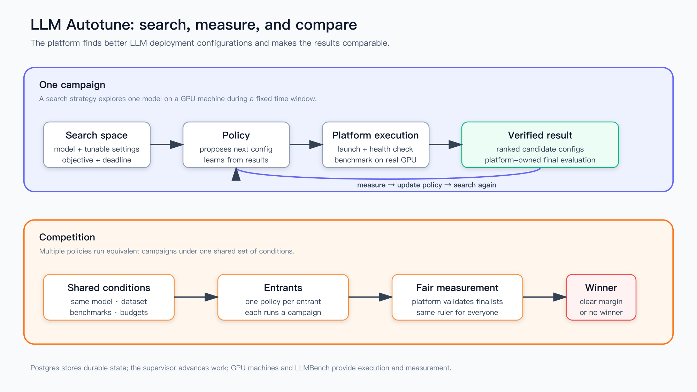

# LLM AutoTune

An inference engine has dozens of knobs, and the right setting for one is not the
right setting for the next model, the next card, or the next traffic shape.
Finding them by hand costs GPU nights and produces numbers nobody can reproduce.

LLM AutoTune runs that search as an experiment: you declare what to tune and what
"better" means, and the platform launches each configuration on real GPUs,
benchmarks it, scores it against your objective, and records exactly what ran.



**What makes it different from a sweep script:**

- **The measurement is the platform's, not the search's.** A search algorithm
  never reports its own score. It proposes a configuration; the platform launches
  it, benchmarks it and judges it. That is what makes two runs comparable.
- **Search is a container, not a plugin.** A smarter search is a program that
  talks to an HTTP contract, in any language, versioned on its own. See
  [policy-contract.md](docs/api/policy-contract.md).
- **A borrowed machine is given back.** On a box shared with production, the
  platform captures what is running, verifies it can put it back, tears it down,
  runs the night, and restores it — and refuses to proceed when it cannot.
- **A result knows what produced it.** Every run records its exact launch
  command, engine version, card type and dataset, so a number six months old is
  still worth something.

## Quickstart — the whole loop, no GPUs

The fastest way to understand the platform is to watch it run. Two fakes — an
engine image that answers the same endpoints sglang does, and a benchmark
platform that really does probe the endpoint before reporting invented numbers —
let the entire loop run for real on a laptop cluster.

```bash
git clone --recurse-submodules https://github.com/modelsphere/llm-autotune
cd llm-autotune
kind create cluster

# The fake engine is built locally, and runs against a placeholder weights
# directory on the node (the platform will not start an engine on an empty one).
docker build -t llm-autotune-mock-engine:local mock-engine/
kind load docker-image llm-autotune-mock-engine:local
docker exec kind-control-plane sh -c 'mkdir -p /models/mock && echo {} > /models/mock/config.json'

helm install autotune deploy/helm/llm-autotune \
  -f deploy/helm/llm-autotune/values-mock.yaml \
  --set jwtSecret=$(openssl rand -hex 32) \
  --set adminPassword=changeme
kubectl port-forward svc/autotune-llm-autotune-frontend 8080:80
```

Open <http://localhost:8080> and sign in as `admin` / `changeme`. On a fresh
install the worker restarts a few times until the schema job has run; give it a
minute. Then:

1. **Resources:** on the `local-cluster` machine, click **Lease to platform**.
2. **New campaign:** image `llm-autotune-mock-engine:local`, model path
   `/models/mock`, any served model name, machine `local-cluster`, and a grid
   over one of the mock's knobs, e.g. `mock_token_ms: [2, 20]`. Leave the
   benchmark and objective at their defaults.
3. On the campaign's page, click **Force start**; otherwise a campaign waits for
   its nightly window.

Each run walks `pending → launching → waiting_ready → health_check → benching →
succeeded` in about a minute, and the leaderboard ranks the faster config first.
Nothing measured this way means anything about performance — it proves the
machinery, which is the point.

## Installing it for real

```bash
helm install autotune deploy/helm/llm-autotune \
  --set jwtSecret=$(openssl rand -hex 32) \
  --set adminPassword=... \
  --set llmbench.url=http://llmbench.your-cluster \
  --set gpuCluster.inCluster=true \
  --set publicApiUrl=https://autotune.example.com
```

[docs/deploying.md](docs/deploying.md) covers the values that matter: where GPUs
come from (this cluster, another cluster, or bare-metal boxes over ssh), how the
benchmark platform is reached, and what a policy container needs to call home.

## The pieces

| | |
|---|---|
| **Campaign** | One search: a model, a search space, an objective, a machine pool and a window. |
| **Search space** | The configurations allowed. The platform enumerates it, or a policy explores it. |
| **Objective** | What "better" means: one target metric plus redlines a config must hold. |
| **Run** | One configuration, launched and measured. The unit everything else is built from. |
| **Baseline** | The configuration production actually runs, measured the same way, so a win is a win against something real. |
| **Machine / cluster** | Where runs land: a node pool in a Kubernetes cluster, or a bare-metal box reached over ssh. |
| **Policy** | A container that decides what to try next, over an HTTP contract. |
| **Promotion** | A winner as a change request against the file production is deployed from. |
| **Report** | A written comparison of a baseline against attempts, generated from the runs. |

## Where runs land

The launch layer is a **per-machine driver**, so a fleet can mix substrates while
it migrates:

- **`k8s`** — a slice of a GPU cluster. The driver never picks nodes or devices:
  it asks for a GPU *count* and lets the scheduler place the pod. It renders
  either a plain Deployment plus a NodePort Service, which works on any cluster,
  or a `TuningRun` for the [operator](operator/) to reconcile.
- **`ssh_docker`** — a bare-metal box the platform borrows for the night. The
  worker ssh'es in and runs the engine under `docker run`. Because such a box is
  usually shared with production, the capture-and-restore interlock above is not
  optional here; it is the reason the driver exists in this shape.

## Repository layout

```text
backend/     FastAPI API + the orchestrator worker (Python 3.12, uv)
  app/
    control/    the control stack: search space, orchestrator, launch drivers
    evaluation/ health checks and the benchmark-platform adapter
    agent/      read models an LLM writes performance reports from
frontend/    Vue 3 + TypeScript SPA
deploy/
  helm/      the chart — the supported way to install the platform
  docker/    images, and a compose file for local development
  k8s/       RBAC for a GPU cluster the platform does not run inside
policies/    submodule: llm-autotune-policies — the SDK and two policies
operator/    the optional Kubernetes operator (Go)
mock-engine/ a fake engine, for running the loop without GPUs
docs/        architecture, the API contracts, deployment
```

## Documentation

- [Architecture](docs/architecture.md) — what the system is and the few choices
  that decide the rest. 中文：[架构概览](docs/architecture.zh.md)
- [How it works](docs/workflow.md) — the product walkthrough, no code.
  中文：[产品视角](docs/workflow.zh.md)
- [Deploying](docs/deploying.md) — the chart, GPU access, and the benchmark platform
- [Policy contract](docs/api/policy-contract.md) — writing a search that plugs in
- [Machine lease API](docs/api/machine-lease.md) — handing machines to the platform
  from another system
- [Agent API](docs/api/agent-api.md) — the read models reports are written from

## What you need to run it for real

- A Kubernetes cluster for the platform itself (it is small: an API, a worker, a
  UI and Postgres).
- GPUs, as a node pool in a cluster or as machines reachable over ssh.
- A benchmark platform to measure runs. The adapter targets LLMBench; the
  `Evaluator` interface in `backend/app/evaluation/base.py` is the seam if you
  measure some other way.

## Contributing

See [CONTRIBUTING.md](CONTRIBUTING.md). The short version: `uv run pytest` in
`backend/`, `npm run typecheck` in `frontend/`, and `helm lint` on the chart.

## License

[Apache License 2.0](LICENSE).
