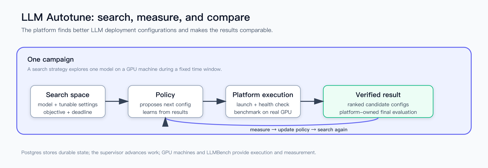
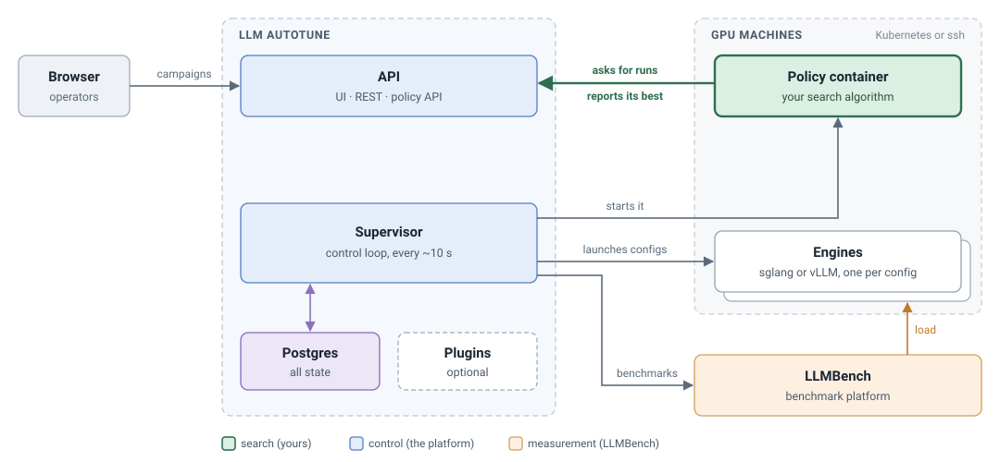

# LLM AutoTune

LLM AutoTune finds the best serving configuration for your model on your
GPUs. A **campaign** sets a model, a **search space** of engine settings
(sglang, vLLM) and an **objective**: one metric to improve, plus redlines a
config must hold. A **policy**, your search algorithm in a container, picks
configs to try; the platform launches each one, benchmarks it with
[LLMBench](https://github.com/modelsphere/llm-bench), and ranks it against the
**baseline**, what production runs today.



## Features

- **Bring any search algorithm.** A policy is any container that speaks a small
  HTTP API ([policy contract](docs/api/policy-contract.md)). Random search is
  included; without a policy the platform enumerates the space.
- **Results you can trust.** The platform measures every config itself, the
  same way, and re-measures the best before it reports. A policy never grades
  its own results.
- **Real GPUs, real traffic.** Benchmarks run on the cards you serve on and
  can replay captured production traffic; a config that breaks a latency or
  quality redline is out.
- **Uses the GPUs you have.** Kubernetes nodes, other clusters, or ssh
  machines, lent to the platform for a nightly window.
- **Reproducible.** Every run records its launch command, engine version, card
  type and dataset.
- **From result to rollout.** A winner comes with its exact launch command
  and image.
- **Restart-safe.** All state is in Postgres; a restart mid-run loses nothing.
- **Extensible.** Plugins add pages, API routes, scheduled steps and search
  strategies ([plugins](docs/plugins.md)).

## How it works



The policy only decides what to try. The supervisor starts it, launches the
configs it asks for, and has LLMBench benchmark them; at the deadline the
platform re-measures the policy's best itself, and that measurement is the
verdict. More in [platform architecture](docs/api/platform-architecture.md).

## Install

You need a Kubernetes cluster for the platforms (no GPUs needed), one or more
GPU clusters (NVIDIA device plugin installed) or ssh-reachable GPU boxes, and
`kubectl`, `helm`, `git` and `openssl` on your machine.

```bash
git clone https://github.com/modelsphere/llm-autotune
cd llm-autotune
deploy/quickstart.sh
```

It installs LLM AutoTune and LLMBench into the cluster kubectl points at
(`--context` to pick another) and connects them with a generated service key.
Then it prints both UIs' addresses
and logins: each UI is opened on a NodePort, at `http://<node address>:<port>`
(on a cluster on your own machine, such as kind or Docker Desktop, it
port-forwards them to <http://localhost:8080> and <http://localhost:8081>
instead).

| | sign in as |
|---|---|
| LLM AutoTune | `admin` and the printed password |
| LLMBench | `admin@example.com` and the printed password |

Then give it GPUs. On each GPU cluster, with its admin kubeconfig, run
`deploy/gpu-cluster.sh`: it creates a namespace and an account limited to it,
and writes a kubeconfig for that account. On **Resources ▸ Add GPU cluster**,
upload the file and pick the GPU nodes to register; lease them to the
platform, then create a search space and a campaign. Running the install
script again upgrades the same install.

- [After installing](docs/after-installing.md): your own values, search
  policies, more GPUs (another cluster, ssh machines), ingress, datasets.
- [Deploying](docs/deploying.md): installing the Helm chart yourself, and every
  setting.

## Try it without GPUs

```bash
deploy/demo.sh --kind
```

Creates a local [kind](https://kind.sigs.k8s.io/) cluster (give Docker about
8 GB), installs both platforms there, and starts a demo campaign on a mock
engine that needs no GPU. The whole loop runs for real, but the numbers mean
nothing about performance. `deploy/demo.sh down --kind` removes it.

## The pieces

| | |
|---|---|
| **Campaign** | One search: a model, a search space, an objective, a machine pool and a window. |
| **Search space** | The configurations allowed. The platform enumerates it, or a policy explores it. |
| **Objective** | What "better" means: one target metric plus redlines a config must hold. |
| **Run** | One configuration, launched and measured. |
| **Baseline** | The configuration production runs today, measured the same way. |
| **Machine / cluster** | Where runs land: a node pool in a Kubernetes cluster, or a bare-metal box reached over ssh. |
| **Policy** | A container that decides what to try next. |
| **Report** | A written comparison of a baseline against attempts (agent API, off by default). |

## Repository layout

```text
backend/     FastAPI API + the orchestrator worker (Python 3.12, uv)
  app/
    control/    the control stack: search space, orchestrator, launch drivers
    evaluation/ health checks and the benchmark-platform adapter
    agent/      read models an LLM writes performance reports from
frontend/    Vue 3 + TypeScript SPA
deploy/
  quickstart.sh  install both platforms on your cluster; demo.sh: the no-GPU try-out
  helm/      the chart
  docker/    images, and a compose file for local development
  k8s/       RBAC for a GPU cluster the platform does not run inside
policies/    submodule: llm-autotune-policies — the SDK and two policies
operator/    the optional Kubernetes operator (Go)
mock-engine/ a fake engine, for running the loop without GPUs
docs/        architecture, the API contracts, deployment
```

## Documentation

- [Architecture](docs/architecture.md) — what the system is and the few choices
  that decide the rest. 中文：[架构概览](docs/architecture.zh.md)
- [How it works](docs/workflow.md) — the product walkthrough, no code.
  中文：[产品视角](docs/workflow.zh.md)
- [After installing](docs/after-installing.md) — your own values, policies,
  more GPUs, ingress and datasets
- [Deploying](docs/deploying.md) — the chart, GPU access, the benchmark
  platform, and every other setting
- [Plugins](docs/plugins.md) — extending the platform without forking it
- [Policy contract](docs/api/policy-contract.md) — writing a search that plugs in
- [Machine lease API](docs/api/machine-lease.md) — handing machines to the platform
  from another system
- [Agent API](docs/api/agent-api.md) — the read models reports are written from
  (off by default)

## Contributing

See [CONTRIBUTING.md](CONTRIBUTING.md). The short version: `uv run pytest` in
`backend/`, `npm run typecheck` in `frontend/`, and `helm lint` on the chart.

## License

[Apache License 2.0](LICENSE).
