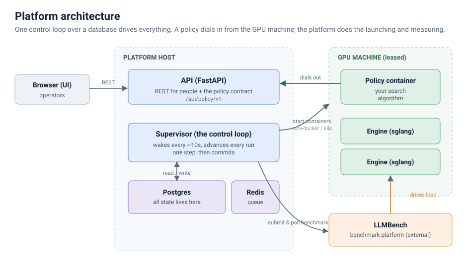
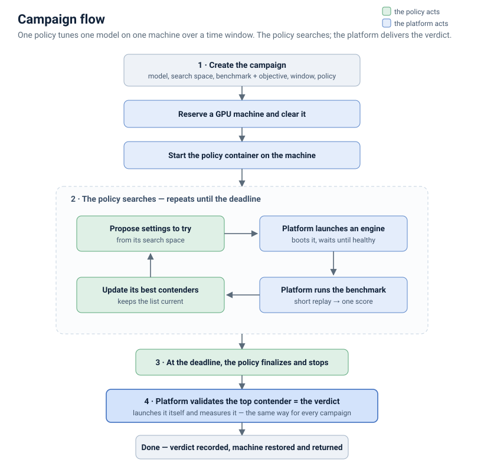

# Platform architecture

The platform finds the best way to run a given model on an inference engine
(sglang). You give it a model and a set of engine settings to explore; it tries
settings on real GPUs, measures each against replayed production traffic, and
reports the ones that beat what you run today.

The search itself is done by a **policy** — a container that holds a search
algorithm. The platform owns the machines, performs the measurements, and decides
the result; the policy only decides what to try next. This is the standard model:
a search strategy is a policy, not something built into the platform.

This is the plain-language architecture guide, companion to the
[policy API](policy-api.md). 中文：[platform-architecture.zh.md](platform-architecture.zh.md).

---

## The pieces

- **Browser (UI)** — where operators create campaigns and watch
  them run.
- **API** — a single HTTP service with two audiences: people (the REST API behind
  the UI) and policies (the policy contract at `/api/policy/v1`).
- **Supervisor** — the control loop, and the heart of the platform. It wakes
  roughly every 10 seconds, advances every active piece of work by one step, and
  commits. There is no job queue: the database is the to-do list (see below).
- **Postgres** — all state. Every campaign, run, result, machine, and contender
  is a row. Nothing important lives only in memory, which is why a platform
  restart mid-run loses nothing — it re-reads where it was and continues.
- **GPU machine** — a machine leased for the night. The platform starts two kinds
  of container on it: the **policy container** (the search), and **engine
  containers** (the thing being tuned).
- **LLMBench** — the external benchmark platform. It drives realistic load
  against a running engine and returns the numbers; the platform submits a
  benchmark and polls for the result.

---

## One idea shapes everything: the database is the to-do list

A run is a row in Postgres, not a job on a queue. The supervisor wakes on a
timer, looks at the database, and moves every unfinished run one legal step
closer to done — then commits once. Each tick recomputes what to do from scratch.

Two consequences worth knowing:

- **Restarts are safe.** Because every external handle (container name, endpoint,
  benchmark id) is stored on the row, a supervisor that dies mid-benchmark
  re-attaches to the still-running work on restart instead of losing it.
- **Exactly one writer.** A single supervisor holds a lock; a second one cannot
  start and corrupt the state. The UI and the worker read the same rows, so they
  never disagree about what is happening.

---

## A campaign

A **campaign** is one policy tuning one model, on one machine, over a time window
(usually a night).

The shape of a night:

1. **Set up.** At the start of the window the platform reserves a GPU machine,
   clears it for use, and starts the policy container on it.
2. **The policy searches.** This is the loop in the middle of the diagram, and it
   is driven entirely by the policy: it proposes engine settings, the platform
   starts an engine and benchmarks it, and the policy updates its short list of
   best settings ("contenders"). The platform simply serves these requests — it
   does not decide what to try.
3. **The deadline.** When the search time is up, the policy stops and finalizes.
4. **The verdict.** The platform takes the policy's top contender, starts it
   itself, and measures it — the same way for every campaign. *That* measurement
   is the result. A policy's own numbers guide its search but never decide the
   outcome, so the result never depends on how a particular policy measured
   things.
5. **Done.** The verdict is recorded, and the machine is restored and handed back.

Two properties make the numbers trustworthy:

- **The measurement is the platform's, not the policy's** — so every campaign is
  judged on the same scale.
- **The replay dataset is pinned.** The benchmark replays real production
  traffic, and that traffic drifts over time. A campaign freezes one sample of it
  at the start and uses that throughout, so every number from that campaign is
  measured with the same instrument and can be compared.

---

## The rules that keep results honest

- **The verdict is always the platform's own measurement**, on the pinned
  dataset. Nothing a policy reports about itself decides a ranking.
- **A machine is cleared before tuning runs on it, and restored before it is
  handed back** — the platform never destroys what it did not capture, and never
  returns a machine with production still down.
- **A container is confirmed gone before its GPUs are reused**, so a
  half-torn-down engine can never interfere with the next run on that machine.
- **Every result records the exact dataset it ran on**, so two numbers are
  compared only when they are actually comparable.

---

*Companion documents: the [policy API](policy-api.md) (what a policy must
implement) and [policy-contract.md](policy-contract.md) (the full contract).*
