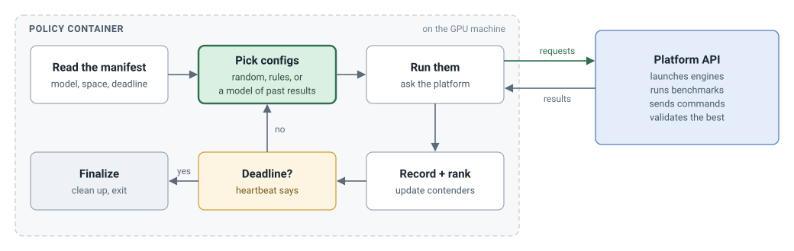

# Platform architecture

How a campaign runs: what the platform does, and what the policy does. The
contract a policy implements is the [policy API](policy-api.md). 中文：[平台架构](platform-architecture.zh.md)

## The pieces

- **Browser** — operators create campaigns and watch them run.
- **API** — one HTTP service: the REST API behind the UI, and the policy API
  at `/api/policy/v1`.
- **Supervisor** — the control loop. It wakes about every 10 seconds,
  advances every piece of work one step, and commits. All state is in
  **Postgres**, so a restart loses nothing ([architecture](../architecture.md)).
- **GPU machines** — Kubernetes nodes, or machines reached over ssh, taken for
  a campaign's window. The platform starts the **policy container** and the
  **engines** (sglang or vLLM) on them.
- **LLMBench** — the benchmark platform. It drives load against an engine and
  returns the numbers.
- **Plugins** — optional packages that add pages, API routes, scheduled steps
  and search strategies ([plugins](../plugins.md)).

## The policy

A **policy** is a search algorithm in a container. It decides which configs to
try next; it owns no machine and does no final measurement.

1. **Read the manifest**: the model, the search space, the deadline, the
   benchmark.
2. **Pick configs**: random sampling, rules, or a model of past results.
3. **Run them**: ask the platform to launch an engine and benchmark it.
4. **Record and rank**, and keep the platform's list of its best configs
   (contenders) current.
5. **Heartbeat** all along; the reply says keep searching, finalize, or exit.

A policy's own numbers steer its search. The verdict is always the platform's
own measurement, so results from different policies are comparable.

## One campaign

1. **Set up.** When the window opens, the platform reserves a leased machine
   and starts the policy on it.
2. **Search.** The policy proposes configs; the platform launches and
   benchmarks each one and returns the result. The platform never decides what
   to try.
3. **Deadline.** The policy stops and finalizes.
4. **Verdict.** The platform launches the policy's top contender itself and
   measures it, the same way for every campaign.
5. **Done.** The verdict is recorded, the platform stops its own runs, and
   the machine is handed back.

Without a policy, the platform enumerates the search space itself; steps 3 to
5 are the same.

## Rules that keep results honest

- **The verdict is the platform's measurement**, on the campaign's pinned
  dataset. Nothing a policy reports about itself decides a ranking.
- **A machine is leased free, and the platform stops only what it launched.**
- **A container is confirmed gone before its GPUs are reused**, so a
  half-stopped engine cannot disturb the next run.
- **Every result records the dataset it ran on**, so only comparable numbers
  are compared.
