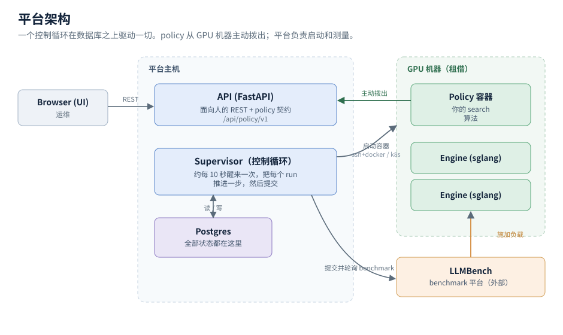
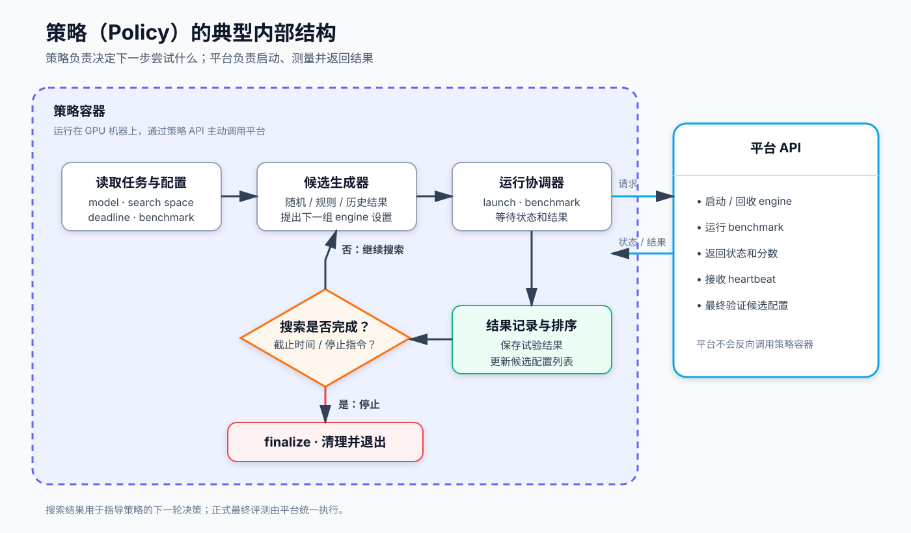
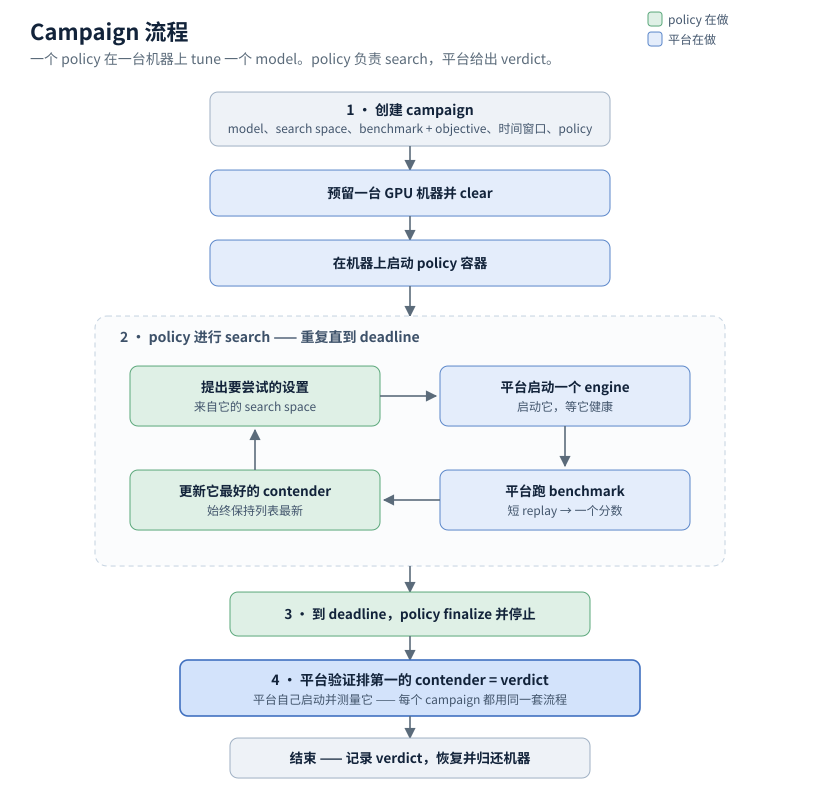

# 平台架构

平台的目标：为给定的 model，在推理 engine（sglang）上找到最好的运行方式。你提供一个 model 和一组要探索
的 engine 设置；平台在真实 GPU 上尝试这些设置，用回放的生产流量测量每一组，并报告出哪些优于你当前在用的
配置。

search 本身由 **策略** 完成 —— 一个封装了 search 算法的容器。平台负责机器、负责测量、并决定最终结果；
策略只决定下一步尝试什么。这是标准模型：搜索算法封装在策略容器里，而不是内建在平台里的东西。

这是一份通俗的架构说明，与 [策略 API](policy-api.zh.md) 配套。English：
[platform-architecture.md](platform-architecture.md)。

---

## 组成部分

- **Browser (UI)** —— 运维在这里创建 调优任务 并观察运行。
- **API** —— 单一的 HTTP 服务，面向两类使用者：人（UI 背后的 REST API）和 策略（`/api/policy/v1` 的
  策略 契约）。
- **Supervisor** —— 控制循环，也是平台的核心。它大约每 10 秒醒来一次，把每一项进行中的工作推进一步，然后
  提交。这里没有任务队列：数据库就是待办清单（见下）。
- **Postgres** —— 全部状态。每个 调优任务、run、result、machine、候选配置 都是一行。没有重要的东西只存在
  内存里 —— 因此平台运行到一半重启也不会丢失，它会重新读取进度并继续。
- **GPU 机器** —— 为当晚租借的机器。平台在上面启动两类容器：**策略 容器**（负责 search）和 **engine
  容器**（被 tune 的对象）。
- **LLMBench** —— 外部的 benchmark 平台。它对运行中的 engine 施加真实负载并返回结果；平台提交一个 benchmark
  并轮询结果。

---

## 一个贯穿全局的核心思想：数据库就是待办清单

一个 run 是 Postgres 里的一行，而不是队列里的一个任务。Supervisor 按时醒来，查看数据库，把每一个未完成的
run 向"完成"推进一个合法步骤，然后提交一次。每一轮都从头重新计算该做什么。

有两点值得了解：

- **重启是安全的。** 因为每个外部句柄（容器名、endpoint、benchmark id）都存在行上，一个在 benchmark 途中
  挂掉的 supervisor 重启后会重新接管仍在运行的工作，而不是把它丢掉。
- **只有一个写入者。** 单个 supervisor 持有一把锁；第二个无法启动、也就无法破坏状态。UI 和 worker 读的是
  同一批行，因此它们对"正在发生什么"不会产生分歧。

---

## 策略（Policy）

**策略**是运行在 GPU 机器上的搜索程序：它根据 search space 和已经观测到的结果，决定下一步要尝试哪组 engine 设置。策略本身不拥有机器，也不负责最终测量；它只负责搜索决策。

一个典型的策略内部包含几部分：

- **任务读取与配置。** 读取 model、可调设置、时间截止点和 benchmark 信息，并初始化自己的 search space。
- **候选生成器。** 根据随机采样、规则、历史结果或其它算法提出下一组 engine 设置。
- **运行协调器。** 请求平台启动 engine、等待就绪，并发起 benchmark；平台通过 API 返回状态和结果。
- **结果记录与排序。** 保存尝试过的配置和分数，维护一份随时可交给平台验证的候选配置列表。
- **heartbeat loop。** 周期性报告仍在运行，并根据平台返回的指令继续搜索、停止并清理，或关闭。

策略的典型循环如下：

关键边界是：策略可以用 benchmark 结果指导下一次搜索，但正式的最终评测仍由平台在统一条件下执行。这样不同策略的最终分数才可比较。

---

## 调优任务（Campaign）

一个 **调优任务** 是：一个 策略，在一台机器上，用一段时间窗口（通常是一晚）tune 一个 model。

一晚的大致过程：

1. **准备。** 窗口开始时，平台预留一台 GPU 机器、将其 clear 以供使用，并在其上启动 策略 容器。
2. **策略 进行 search。** 这就是图中间的循环，完全由 策略 驱动：它提出 engine 设置，平台启动一个
   engine 并对其 benchmark，策略 更新它那份"最优设置"的简短列表（候选配置）。平台只是响应这些请求 ——
   它不决定尝试什么。
3. **截止时间。** search 时间用完后，策略 停止并 finalize。
4. **最终评测结果。** 平台取走 策略 排第一的 候选配置，自己把它启动并测量 —— 对每个 调优任务 都用同一套流程。
   这次测量才是结果。策略 自己的数字用来指导它的 search，但不决定结果，因此结果不取决于某个 策略 是怎么
   测的。
5. **完成。** 记录 最终评测结果，机器被恢复并交还。

有两点让这些数字可信：

- **测量是平台做的，而不是 策略 做的** —— 因此每个 调优任务 都在同一把尺子上被评判。
- **replay dataset 是 pin 住的。** benchmark 回放真实的生产流量，而这些流量会随时间漂移。一个 调优任务 在
  开始时冻结其中一份样本并全程沿用，因此该 调优任务 的每个数字都用同一件仪器测得，可以互相比较。

---

## 让结果保持可信的几条规则

- **最终评测结果 永远是平台自己的测量**，跑在 pin 住的 dataset 上。策略 对自身的任何上报都不决定排名。
- **机器在 tune 之前先被 clear，在交还之前先被恢复** —— 平台绝不销毁它没有捕获过的东西，也绝不在生产仍处于
  停止状态时交还机器。
- **容器被确认已消失后，其 GPU 才会被重新使用**，因此一个只拆到一半的 engine 绝不会干扰该机器上的下一个 run。
- **每个 result 都记录它实际所用的 dataset**，因此只有当两个数字确实可比时，才会被拿来比较。

---

[策略 API](policy-api.zh.md)（策略 必须实现什么）与
[策略-contract.md](policy-contract.md)（完整契约）。*
