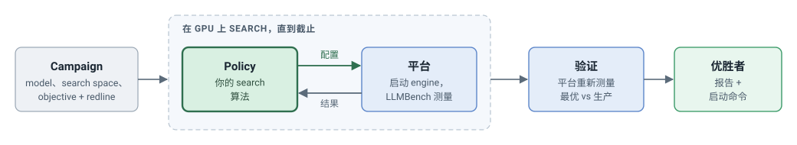
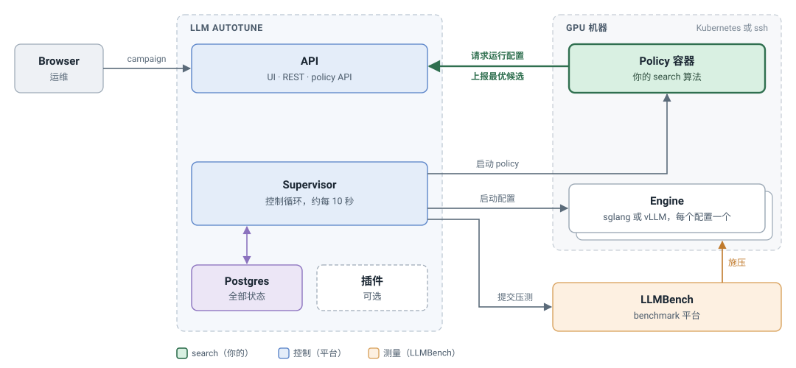
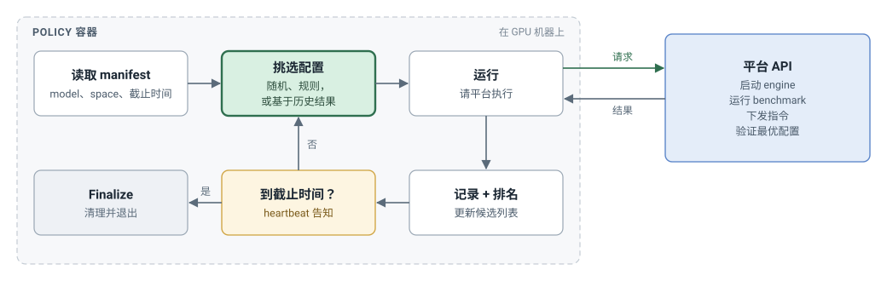

# 平台架构

一个 campaign 是怎么跑的：平台做什么，policy 做什么。policy 要实现的契约见 [policy API](policy-api.zh.md)。
English：[Platform architecture](platform-architecture.md)

## 组成部分

- **Browser** —— 运维在这里创建 campaign 并查看运行情况。
- **API** —— 一个 HTTP 服务：UI 背后的 REST API，以及 `/api/policy/v1` 上的 policy API。
- **Supervisor** —— 控制循环。大约每 10 秒醒来一次，把每项工作推进一步，然后提交。全部状态都在
  **Postgres** 里，所以重启不会丢东西（[架构](../architecture.zh.md)）。
- **GPU 机器** —— Kubernetes 节点，或通过 ssh 访问的机器，在 campaign 的时间窗内由平台接管。平台在上面启动
  **policy 容器**和 **engine**（sglang 或 vLLM）。
- **LLMBench** —— benchmark 平台。它对 engine 施加负载并返回数字。
- **部署仓库** —— 晋级的优胜者以 merge request 的形式提交到这里。
- **插件** —— 可选的扩展包，增加页面、API 路由、定时步骤和 search 策略（[plugins](../plugins.md)）。

## Policy

**policy** 是装在容器里的 search 算法。它决定下一步试哪些配置；它不拥有机器，也不做最终测量。

1. **读取 manifest**：model、search space、截止时间、benchmark。
2. **挑选配置**：随机采样、规则，或基于历史结果的模型。
3. **运行**：请平台启动 engine 并做 benchmark。
4. **记录并排名**，并保持平台上那份最优配置列表（contenders）是最新的。
5. **全程发 heartbeat**；回复会告诉它继续 search、finalize 还是退出。

policy 自己的数字用来指导 search。结论永远是平台自己的测量，所以不同 policy 的结果可以比较。

## 一个 campaign

1. **准备。** 时间窗开始时，平台预留一台机器、清空它，并在上面启动 policy。
2. **Search。** policy 提出配置；平台启动并 benchmark 每一个，再把结果返回。平台从不决定试什么。
3. **截止。** policy 停止并 finalize。
4. **结论。** 平台亲自启动 policy 排第一的 contender 并测量它，对每个 campaign 都用同样的方式。
5. **完成。** 记录结论，恢复机器并归还。

没有 policy 时，平台自己枚举 search space；第 3 到 5 步相同。

## 保证结果可信的规则

- **结论是平台的测量**，在 campaign pin 住的 dataset 上。policy 对自己的任何上报都不决定排名。
- **tune 之前先清空机器，归还之前先恢复。** 平台从不销毁它没有捕获过的东西。
- **确认容器已经消失后才复用它的 GPU**，所以拆到一半的 engine 不会干扰下一个 run。
- **每条结果都记录它用的 dataset**，所以只比较可比的数字。
