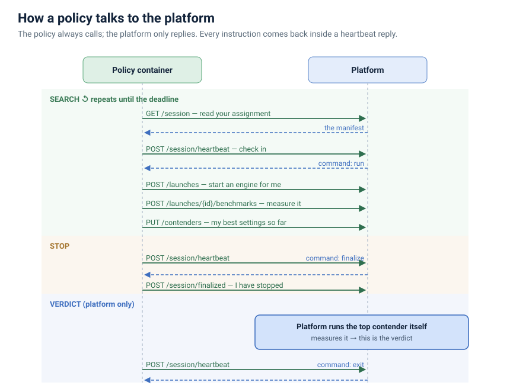

# Policy ↔ Platform API

A **policy** is a container the platform runs on a GPU machine for one night. Its
job: try different engine settings and return the ones that performed best. The
platform owns the machine, performs the measurements, and decides the final
result.

This is the plain-language guide. Exact request/response shapes are at
[`/api/docs`](/api/docs); the full version is [policy-contract.md](policy-contract.md).
中文：[policy-api.zh.md](policy-api.zh.md).

**Three terms used throughout**

- **session** — one policy, tuning one model, on one machine, for one night.
- **contender** — a set of engine settings you propose as a good answer.
- **verdict** — the platform's own measurement of a contender. The only score
  that counts toward the result.

---

## How it works

You are given a machine and a fixed amount of time. You spend it trying engine
settings and maintaining a short list of your best ones. When the time is up, the
platform takes that list and measures it itself to produce the official result.
Your container is then removed and the machine is handed back.

Two rules govern how you talk to the platform:

- **You call it; it never calls you.** Every instruction is returned in the reply
  to your heartbeat (below). Nothing connects inbound to your container.
- **It is not instant.** The platform acts on a request within about 10 seconds.
  Plan in minutes, not milliseconds.

**Connecting.** Your container starts with three environment variables: the URL
to call, an API key, and a session id. Send the key as `X-API-Key` on every
request. It is valid only for this session.

For how a policy fits into the wider system — campaigns, the
control loop — see the [platform architecture](platform-architecture.md).

---

## Required

Five calls. Implement these and you have a valid policy, even if you use nothing
else.

1. **Read your assignment — `GET /session`.** Everything about tonight: the
   model, the machine and its GPU count, which engine settings you may change,
   and your deadlines. Read it first, and re-read whenever you like — deadlines
   can change (an operator may end the night early).

2. **Send a heartbeat — `POST /session/heartbeat`, at least every 30s.** It
   signals that you are still running and returns one instruction: *continue*,
   *stop and clean up*, or *shut down*. If you stop sending heartbeats, the
   platform treats you as unresponsive and ends the session.

3. **Declare what you are tuning — `PUT /session/plan`.** List the engine settings
   you intend to vary. This is shown to the operators watching the run.

4. **Keep your best answers current — `PUT /contenders`.** This call matters
   most. Replace the list whenever you find better settings. If your container
   fails, the platform measures whatever is on this list — so keep it current.
   Each entry must be complete enough for the platform to start an engine from it
   without your involvement.

5. **Confirm when you stop — `POST /session/finalized`.** When your heartbeat
   instructs you to stop, shut down anything you started, then call this so the
   platform knows the machine is free.

---

## Recommended: let the platform run and measure engines

This is the normal way to work. You propose settings; the platform starts the
engine, keeps it healthy, and measures it for you. Most policies — including
random search — use only these calls plus the required ones.

- `POST /launches` — start an engine with these settings. The platform boots it,
  health-checks it, and keeps it running until you release it.
- `GET /launches/{id}` — check its status: starting, ready, or failed (with the
  reason).
- `DELETE /launches/{id}` — release the engine and free its GPUs.
- `POST /launches/{id}/benchmarks` — run the benchmark against that engine and
  return a single score.
- `GET /benchmarks/{id}` — retrieve the score once it completes.

A benchmark the platform runs this way is recorded automatically; you do not
report it.

---

## Optional

Use these only if you need them.

- **Run your own engines.** For a policy that starts and serves engines itself
  instead of using the launch service above:
  - `POST /benchmarks` — measure an engine you are serving yourself (you supply
    its port and the settings behind it).
  - `POST /contenders/{id}/serving` — serve a contender, but only when a heartbeat
    asks you to. That happens in one case only: your winning settings need an
    engine image the platform cannot start itself. Otherwise the platform
    measures your contenders without you, and you never call this.

- **Report your own measurements.** `POST /trials` records a result you measured
  yourself, so it appears in the dashboard and this campaign's history; `GET
  /trials` reads the list back. (Only the platform's own measurement is a verdict.)

- **Carry state between nights.** `PUT /state` saves a file; `GET /state` reads it
  back on a later night of the same campaign. Use it only if your search learns
  across nights — for example, to skip settings it already ruled out. If each
  night starts fresh, ignore it.

- **Record a message.** `POST /events` posts a short status line to the run's
  timeline, for operators to read.

---

## The final result

When your search time ends, the platform takes over. It starts your top contender
itself and measures it — the same way for every policy — and that measurement is
the **verdict**. Your own numbers guide your search but do not decide the ranking.
(The one exception is the "serve it yourself" case above, where the platform
measures the engine you serve.)

---

## Config format

Every engine setting, in both directions, is a flat set of name→value pairs
(JSON) in the platform's spelling: `tp_size`, not `--tp-size`; a real `true`, not
`"true"`. **Do not set placement fields** — where the model loads, the host, the
port — the platform supplies those. Send your settings; the platform normalizes
them and returns the exact form it will use.

You may try a setting outside the ones your assignment lists, as long as your plan
declares it — it is recorded, not rejected. The only hard rejections are for
safety: a config that does not fit the GPUs, or a malformed value.

---

## Errors

| Status | Meaning | What to do |
| --- | --- | --- |
| `401` | Token is no longer valid | The session is over for you; exit. |
| `409` | Not permitted at this point (e.g. launching after being told to stop) | Re-read your last heartbeat instruction and follow it. |
| `422` | Settings rejected as unsafe (do not fit the GPUs, or malformed) | Fix the settings and retry. |
| `429` | No free GPUs or ports at the moment | Wait, or release something you hold. |

The SDK (`autotune-policy-sdk`) implements the required calls and the retry
handling for you; a policy built on it satisfies this contract by construction.
