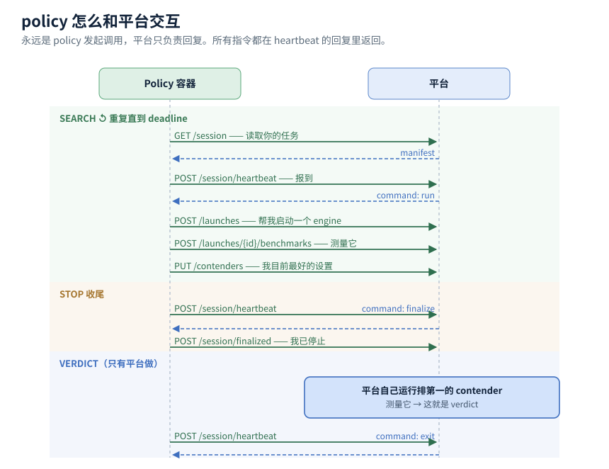

# Policy ↔ Platform API

一个 **policy** 是平台在一台 GPU 机器上运行一晚的容器。它的任务：尝试不同的 engine 设置，返回其中表现
最好的几组。机器由平台管理，测量由平台执行，最终结果也由平台决定。

本文是一份通俗说明。具体的请求/返回格式见 [`/api/docs`](/api/docs)；完整版见
[policy-contract.md](policy-contract.md)。English：[policy-api.md](policy-api.md)。

**全文使用的三个术语**

- **session** —— 一个 policy，在一台机器上，用一晚 tune 一个 model。
- **contender** —— 你提出的一组 engine 设置，作为一个候选答案。
- **verdict** —— 平台自己对某个 contender 的测量结果，也是唯一计入最终结果的分数。

---

## 工作方式

平台为你分配一台机器和一段固定的时间。你用这段时间尝试各种 engine 设置，并维护一个"当前最优"的简短
列表。时间结束时，平台取走该列表并自行测量，得出正式结果。随后你的容器被移除，机器被交还。

与平台交互有两条规则：

- **只能你调用平台，平台不会调用你。** 所有指令都在平台对你 heartbeat 的返回中给出（见下）。没有任何
  连接会主动连入你的容器。
- **交互不是实时的。** 平台大约每 10 秒处理一次请求。请以分钟为单位安排，而非毫秒。

**连接方式。** 你的容器启动时会带三个环境变量：要调用的 URL、一个 API key、一个 session id。每次请求都用
`X-API-Key` 带上该 key。它仅在本 session 内有效。

policy 在整个系统中的位置 —— campaign、控制循环 —— 见
[平台架构](platform-architecture.zh.md)。

---

## 必需

一共五个调用。实现这五个，你就是一个合法的 policy，即使不用其它任何接口。

1. **读取你的任务 —— `GET /session`。** 今晚的全部信息：model、机器及其 GPU 数量、你可以修改哪些
   engine 设置、以及你的截止时间。先读取一次；之后可随时重新读取 —— 截止时间可能变化（运维可能提前
   结束当晚）。

2. **定期发送 heartbeat —— `POST /session/heartbeat`，至少每 30 秒一次。** 它表示你仍在运行，并在返回
   中给你一条指令：*继续*、*停止并清理*、或*关闭*。如果你停止发送 heartbeat，平台会判定该 session 已
   失去响应，并结束它。

3. **声明你要调整的设置 —— `PUT /session/plan`。** 列出你计划修改的 engine 设置。此信息会展示给关注本次
   运行的运维人员。

4. **及时更新你最优的候选 —— `PUT /contenders`。** 这是最重要的一个调用。每当你找到更好的设置，就替换
   整个列表。如果你的容器失败，平台会测量此列表中的内容 —— 因此务必保持最新。列表中的每一项都必须足够
   完整，使平台无需你参与即可据此启动 engine。

5. **停止时进行确认 —— `POST /session/finalized`。** 当 heartbeat 指示你停止时，关闭你启动过的一切，然后
   调用此接口，以便平台知道机器已释放。

---

## 推荐：由平台启动并测量 engine

这是常规的工作方式。你提出设置，平台负责启动 engine、保持其健康、并为你测量。多数 policy（包括 random
search）只使用这些调用，加上必需的五个。

- `POST /launches` —— 用这些设置启动一个 engine。平台会将其启动、做健康检查、并保持运行，直到你释放它。
- `GET /launches/{id}` —— 查看状态：启动中、就绪、或失败（附原因）。
- `DELETE /launches/{id}` —— 释放该 engine 并回收其 GPU。
- `POST /launches/{id}/benchmarks` —— 对该 engine 运行 benchmark，返回一个分数。
- `GET /benchmarks/{id}` —— 完成后取回分数。

以这种方式由平台运行的 benchmark 会被自动记录，你无需上报。

---

## 可选

仅在需要时使用。

- **自行运行 engine。** 如果你的 policy 自己启动并 serve engine，而不使用上面的 launch 服务：
  - `POST /benchmarks` —— 测量一个你自己 serve 的 engine（你需提供其 port 以及背后的设置）。
  - `POST /contenders/{id}/serving` —— serve 一个 contender，但仅当 heartbeat 要求你这样做时。这只在一种
    情况下发生：你胜出的设置需要一个平台自身无法启动的 engine image。否则平台会自行测量你的 contender，
    你不会调用此接口。

- **上报你自己的测量。** `POST /trials` 记录一次你自己测量的结果，使其出现在看板和本 campaign 的历史中；
  `GET /trials` 读回该列表。（只有平台自己测量的结果才算 verdict。）

- **跨晚保存 state。** `PUT /state` 保存一个文件；`GET /state` 在同一 campaign 的后续某晚将其读回。仅当你的
  search 需要跨晚积累信息时使用它 —— 例如跳过已排除的设置。如果每晚都从头开始，则忽略它。

- **记录一条信息。** `POST /events` 向本次运行的时间线发送一行简短状态，供运维人员查看。

---

## 最终结果

当你的 search 时间结束，平台接手：它自行启动你排名第一的 contender 并进行测量 —— 对每个 policy 都采用
同一流程 —— 该次测量即为 verdict。你自己的测量数字用于指导你的 search，但不决定最终排名。（唯一的例外是
上面"自行 serve"的情况，那时平台测量的是你 serve 的 engine。）

---

## Config 格式

所有 engine 设置，两个方向，都是一组扁平的 名称→值 键值对（JSON），采用平台的写法：`tp_size`，而不是
`--tp-size`；写真正的 `true`，而不是 `"true"`。**不要设置 placement 字段** —— model 从何处加载、host、
port —— 这些由平台补充。你只提交你的设置；平台会将其规范化，并返回它最终将使用的形式。

只要你的 plan 中做了声明，你就可以尝试任务清单之外的设置 —— 它会被记录，而不会被拒绝。会被硬性拒绝的
只有安全问题：放不下 GPU 的配置，或格式错误的值。

---

## 错误

| 状态码 | 含义 | 处理方式 |
| --- | --- | --- |
| `401` | token 已失效 | 该 session 对你已结束，退出。 |
| `409` | 当前状态不允许此操作（例如被要求停止后仍去 launch） | 重新读取上一次 heartbeat 的指令并遵循。 |
| `422` | 设置因安全被拒绝（放不下 GPU，或格式错误） | 修正设置后重试。 |
| `429` | 当前没有空闲的 GPU 或 port | 等待，或释放你占用的资源。 |

SDK（`autotune-policy-sdk`）已为你实现了必需的调用与重试处理；基于它构建的 policy 天然满足本 contract。
