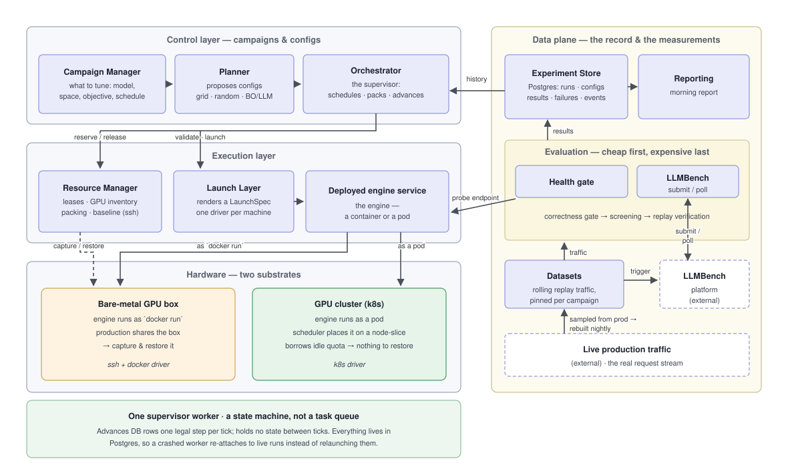
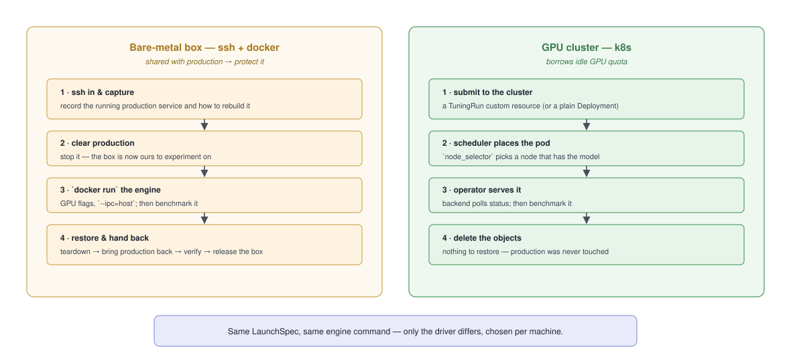
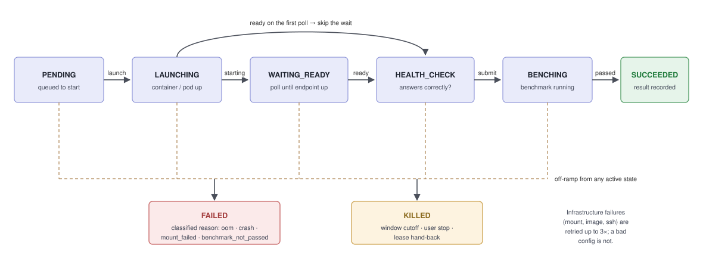
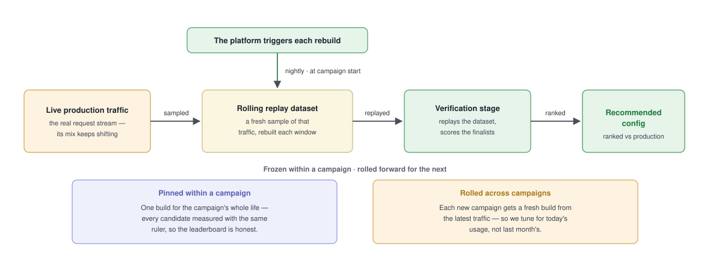
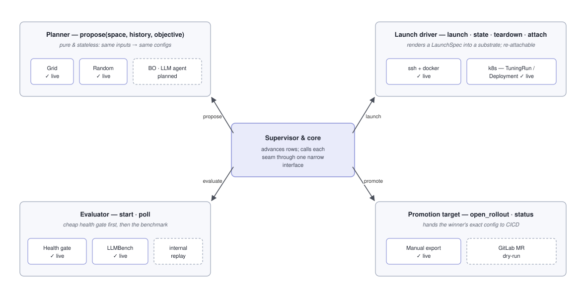

# Architecture Overview

*For engineers. What the system is, how it's shaped, and the few choices that
decide everything else. Product-facing companion:
[workflow-overview.md](workflow-overview.md).*

LLM Autotune finds the best deployment configuration for an LLM inference engine
(sglang, vllm). You give it a model, a search space of engine parameters, and an
objective; it launches candidate configs on GPUs, benchmarks each, and reports
which beat the config you run in production. It replaces the manual loop — deploy
by hand, benchmark, paste numbers into a doc, repeat.

Work happens in **nightly windows**: machines leave production at night, the
platform tunes on them, and production is restored before morning. A campaign
usually spans many nights, resuming from persisted state each evening.

---

## 1. The shape of the system

The **control stack** (left) is layered from most abstract to closest to the
metal; the **data plane** (right) records everything and does the measuring.

- **Control layer** — thinks in campaigns and configs. The *Campaign Manager*
  holds what to tune; a *policy container* proposes configs; the *Orchestrator*
  (the supervisor) schedules them, packs them onto GPUs, and advances each run.
- **Execution layer** — thinks in machines and containers. The *Resource Manager*
  owns leases, GPU inventory, and (on bare metal only) baseline capture/restore;
  the *Launch Layer* deploys the engine through a driver chosen **per machine**.
- **Hardware layer** — two substrates, one per machine: a bare-metal box we ssh
  into, or a slice of a GPU cluster. They are handled differently — see §2.
- **Data plane** — the *Experiment Store* (Postgres) is the system's memory;
  *Evaluation* probes the deployed service and runs the benchmark; *Datasets*
  supply replay traffic; *Reporting* renders the morning report. Nothing here
  touches hardware directly.

---

## 2. Two substrates, one contract

A machine declares its `driver`, so the fleet is mixed through the migration. The
Launch Layer renders the **same `LaunchSpec` and the same engine command** either
way — only the substrate differs, and each is handled on its own terms.

The difference that matters: a bare-metal box is **shared with production**, so it
must be captured and restored; a k8s slice **borrows idle quota**, so nothing is
torn down and the baseline lifecycle is a no-op. The k8s driver never picks nodes
or devices — it asks the scheduler for a GPU *count* and pins placement with
`node_selector` (model weights are a per-node hostPath today). A wedged pod (bad
mount, unpullable image) surfaces its real reason fast instead of timing out.
Full detail: [deploy/k8s/README.md](../../deploy/k8s/README.md).

---

## 3. The idea that shapes everything: a state machine, not a task queue

A run is **a row in Postgres**, not a job on a queue. A single **supervisor**
process wakes on a tick and advances every non-terminal run *one legal step*, then
commits once. There is no dispatch; each tick recomputes what to do from the
database.

Why this and not a task queue:

- **Crash recovery is free.** On startup the supervisor re-derives each live run's
  spec and calls `driver.attach()` to *re-find* the deployment instead of
  relaunching it. A worker that dies mid-benchmark re-attaches to the running
  model and keeps polling — because every external reference (container name,
  endpoint, benchmark id) lives on the row, not in memory.
- **Exactly one writer.** The supervisor holds a Postgres advisory lock; a second
  worker can't start. (Two workers once raced and killed each other's runs.)
- **The state is a `SELECT`,** not an inference over queue internals.

One tick, in order: advance schedules → advance leases → process stops → settle
dataset pins (§5) → plan → advance baseline lifecycle → schedule (pack GPUs) →
advance runs → enforce window cutoffs. The clocks run *first* so a tick never starts a run
the same tick would tear down.

---

## 4. Cheap checks first, expensive tests last

A candidate dies at the cheapest gate that can catch it:

**static validation** (free — constraints, VRAM fit) → **launch + health** (seconds
— runs *and* answers correctly) → **screening benchmark** (minutes — scores
everyone) → **confirmation** (optional — repeat the top-K to beat ~0.25% noise) →
**verification** (optional, ~1 h — replay real traffic, finalists only, scored by
its own objective).

This is what makes ~15–30 experiments a night worthwhile. One gotcha baked in:
**a benchmark that *ran* is not one that *passed*** — LLMBench reports `done` when
its modules merely finished; the verdict is separate, so the evaluator maps `done
+ not passed` to a failure with the breached redlines named.

---

## 5. The measuring stick rolls with production

The verification stage replays **real production traffic**, and that traffic
drifts — so the replay dataset is a **rolling** one, resampled from live prod.
LLMBench collects its own profiles and rolls them every 24 h, which is right for
LLMBench and wrong for a campaign that spans several nights: a rebuild landing
mid-campaign silently swaps the instrument, and two scores from two builds are
not a comparison.

So the platform owns the roll rather than inheriting it:

- **We trigger the rebuild, not LLMBench's clock.** A profile is set aside with
  `schedule_interval_hours: 0`, so nothing rebuilds it but our `trigger_build`
  call. The whole coupling is: ask for a build, get told its id, and read that id
  back off every result (`replay.dataset_id` / `_sha256`). We never fetch
  or inspect the data — LLMBench owns everything behind the id.
- **Fresh across campaigns.** At its first measurement a campaign resolves the
  profile's current build; under `rebuild_at_start` it triggers a fresh one from
  the latest traffic. This is what keeps tuning honest to *current* usage — a
  winner is optimal for how the model is used now, not for a stale snapshot.
- **Frozen within one.** A campaign **pins** its build (`dataset_build_id`) at
  first measurement and keeps it for life. A rebuild is an exclusive write and a
  pin is a shared read, so a campaign that arrives while another still holds the
  current build **adopts** it rather than rebuilding — slightly older data, but
  the two campaigns become directly comparable, which is worth more.
- **Asked for early, needed late.** The pin is settled when the window opens, not
  when verification wants it: screening dozens of candidates takes hours and never
  touches the dataset, so a build requested at the start of the night has
  published long before the first replay run needs it. Nothing blocks a tick — a
  build in flight is just a row id to poll next time (a 409 means someone already
  asked; poll *their* row instead of stacking a second build).

Every result carries the dataset it actually ran on, so a run measured on the
wrong build is flagged **not comparable** rather than silently ranked — the one
way to tell whether two nights' replay numbers can be compared at all.

---

## 6. Every boundary is a swappable seam

Modularity along these seams is a hard requirement: each is a narrow interface
with interchangeable implementations behind a registry, and the core never learns
which one it's talking to.

- **Policy** — an external container that proposes configs over the policy
  session API. The platform validates and canonicalizes every proposal, and
  applies the objective *centrally*, so what a policy is told and what the
  leaderboard ranks cannot disagree.
- **Launch driver** — `launch · state · teardown · attach` over a `LaunchSpec`
  (see §2).
- **Evaluator** — `start · poll`, split so the tick never blocks and the returned
  reference is re-attachable.
- **Promotion target** — `open_rollout · status`, mirroring the driver contract to
  hand a winner's exact config to CICD.

Payoff: the ssh→k8s migration touched one seam; a smarter search touches no
platform code at all — it is a container.

---

## 7. A few load-bearing rules

- **Separated authority.** A search never touches machines — it's data-in,
  configs-out. The supervisor is the *sole* writer of machines and runs; that's
  what the single-writer lock protects.
- **Derived state computed once.** Lifecycle predicates (is this lease draining?
  does this run still fit the window? did the canary pass?) are shared by the
  supervisor and the Resources page, so worker and UI can't disagree. Likewise
  objective + feasibility are computed when a result lands and stored on the row.
- **The baseline interlock.** Experiments run only while a machine is `cleared`,
  and clearing production requires *this campaign's own* canary, on *this*
  machine, to have **passed** — never destroy what wasn't captured, never hand a
  box back with production still down.
- **Results stay comparable.** Configs are scored on a frozen traffic sample —
  the campaign's pinned dataset build (§5) — and each night re-measures
  production, so "×1.15 of production" holds across nights as absolute numbers
  drift.

---

*Background: [design-brainstorm.md](design-brainstorm.md) (rationale),
[tech-stack.md](tech-stack.md), [deploy/k8s/README.md](../../deploy/k8s/README.md).*
