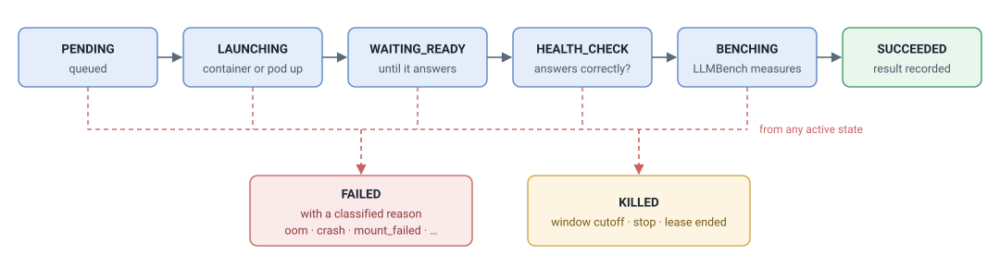
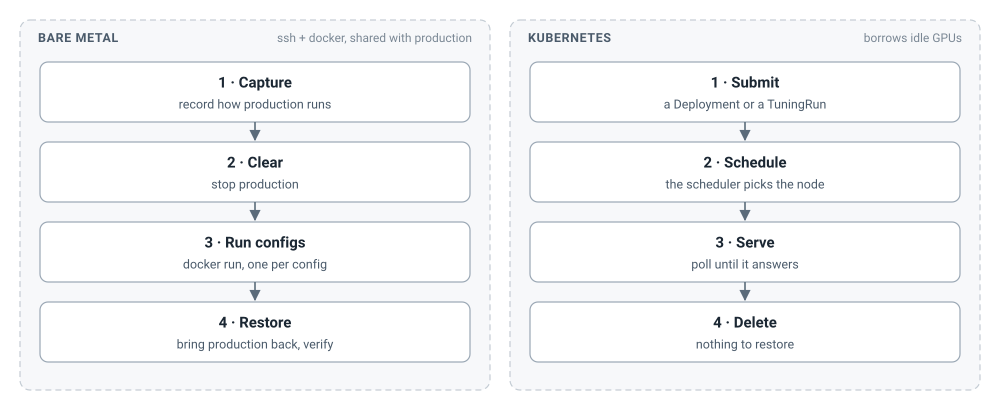
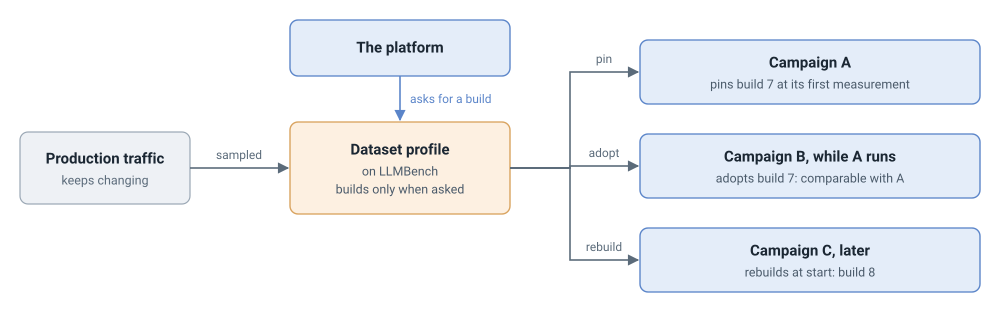
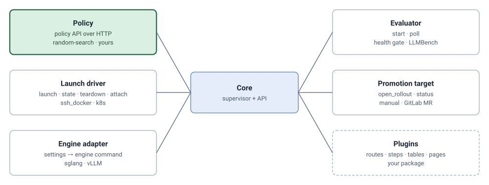

# Architecture

For engineers: how the platform is built, and the few choices everything else
follows from. The same system without the code: [How it works](workflow.md).
中文：[架构](architecture.zh.md)

- **API** — one FastAPI service: the REST API behind the UI, the
  [policy API](api/policy-contract.md), the [agent API](api/agent-api.md) and
  the [machine lease API](api/machine-lease.md).
- **Supervisor** — the worker: one control loop that advances all work.
- **Postgres** — all state.
- **GPU machines** — reached over ssh, or nodes of a Kubernetes cluster. Each
  machine names its own driver, so one fleet can mix both.
- **LLMBench** — the benchmark platform. The supervisor submits a benchmark and
  polls for the result.

## A state machine, not a task queue

A run is a row in Postgres, not a job on a queue. The supervisor wakes every
~10 seconds, moves every unfinished run one legal step, and commits once. Each
tick recomputes what to do from the database.

- **Restarts lose nothing.** Every external handle (container, endpoint,
  benchmark id) is on the row, so a restarted worker re-attaches to running
  work instead of relaunching it.
- **One writer.** The supervisor holds a Postgres advisory lock; a second
  worker cannot start.
- **Failures are classified.** Infrastructure failures (a port, a mount, an
  image) are retried; a config that crashes or runs out of memory is not.

An engine a policy asked for uses one more state, `serving`: launched and
health-checked like any run, then held for the policy instead of benchmarked.

One tick, in order: plugin steps → campaign windows → leases → stop requests →
dataset pins → plan → policy sessions → schedule → advance runs → enforce
windows → reap teardowns. The clocks run first,
so a tick never starts a run that the same tick would tear down.

## Two substrates, one launch spec

Both drivers render the same `LaunchSpec` into the same engine command; only
where it runs differs.

A bare-metal box is leased to the platform free, and the platform only ever
removes the containers it started. A Kubernetes run borrows idle GPUs. The
Kubernetes driver asks for a GPU
count and lets the scheduler place the pod (a machine may pin a node
selector); a pod that cannot start, such as a missing model path or an image
that will not pull, fails fast with its real reason. It renders a plain
`Deployment`, or a `TuningRun` for the [operator](../operator/README.md).

## Cheap checks first

A config stops at the cheapest check that can catch it:

- **Paper check** — the search space's constraints and VRAM fit, before
  anything launches.
- **Launch + health** — the engine starts and answers correctly.
- **Benchmark** — every config, on LLMBench, under the objective's redlines.
- **Confirm** (`confirm_top_k`) — repeat the best few, to rule out noise.
- **Verify** (`verify_benchmark_slug`) — replay real traffic on the top three.

LLMBench reports a benchmark `done` when its modules finish; whether it passed
is separate. The platform treats "done but not passed" as a failure and names
the redlines it crossed.

## Datasets: frozen within a campaign, fresh across them

A replay benchmark plays back a sample of production traffic, and that traffic
changes. The platform, not a timer, decides when the sample is rebuilt.

- **The platform triggers builds.** The profile has
  `schedule_interval_hours: 0`, so only the platform rebuilds it. The platform
  never reads the data; it records the build id each result reports.
- **A campaign pins one build** at its first measurement and keeps it, so all
  its candidates face the same requests.
- **A campaign that starts while another holds the current build adopts it**
  instead of rebuilding underneath it, and the two become directly comparable.
- **`rebuild_at_start`** asks for a fresh build from the latest traffic;
  `use_current` takes the current one.

A result measured on a different build is marked not comparable instead of
being ranked.

## Seams

Each boundary is a narrow interface with implementations in a registry; the
core never knows which one it is talking to.

| Seam | Interface | Implementations |
|---|---|---|
| Policy | the [policy API](api/policy-contract.md), over HTTP | any container; [random search](https://github.com/modelsphere/llm-autotune-policies/tree/main/random-search) included |
| Launch driver | `launch · state · teardown · attach` | `ssh_docker`, `k8s` |
| Engine adapter | settings → engine command | `sglang`, `vllm` |
| Evaluator | `start · poll` | health gate, LLMBench |
| Plugins | routes, tick steps, tables, pages | [your package](plugins.md) |

The platform validates and canonicalizes every config a policy proposes, and
applies the objective itself, so what a policy is told and what the
leaderboard ranks cannot disagree.

## Rules

- **Separate authority.** A policy never touches machines. The supervisor is
  the only writer of machines and runs.
- **Shared predicates.** Lifecycle questions (is this lease draining? does
  this run fit the window?) are answered by the same code for the worker and
  the UI, so the two cannot disagree.
- **The lease is the hand-over.** A machine comes to the platform free and
  goes back when the lease ends; the platform stops only what it launched.
- **Comparable results.** A campaign scores every config on its pinned dataset
  and measures production the same way, so "+12% over production" holds as
  absolute numbers drift.
