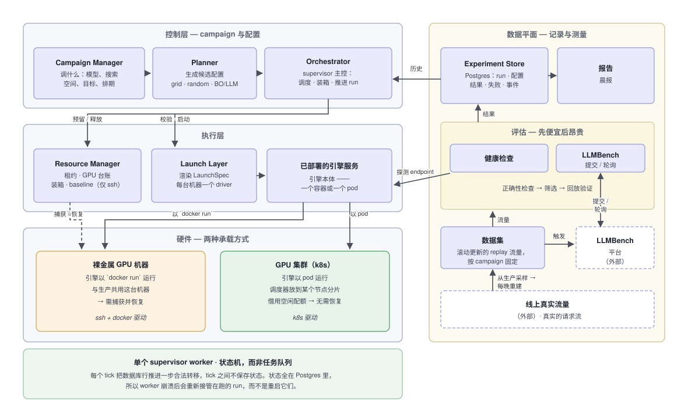
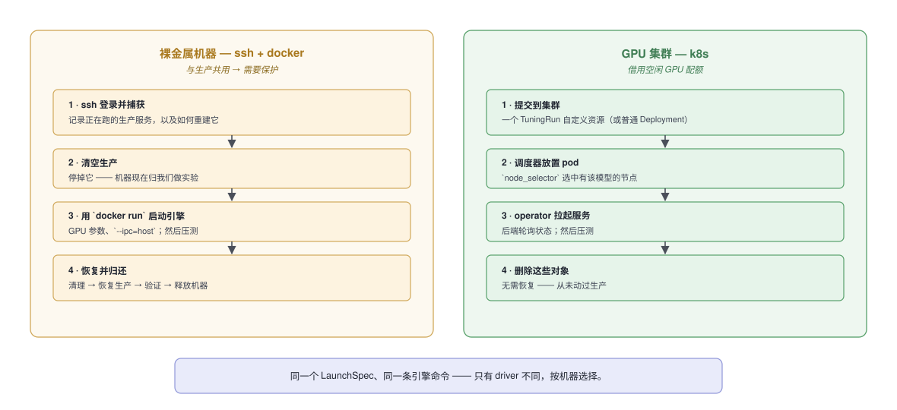
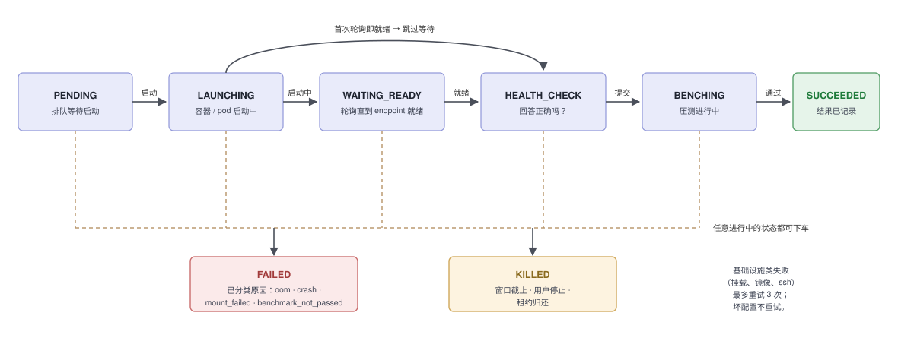
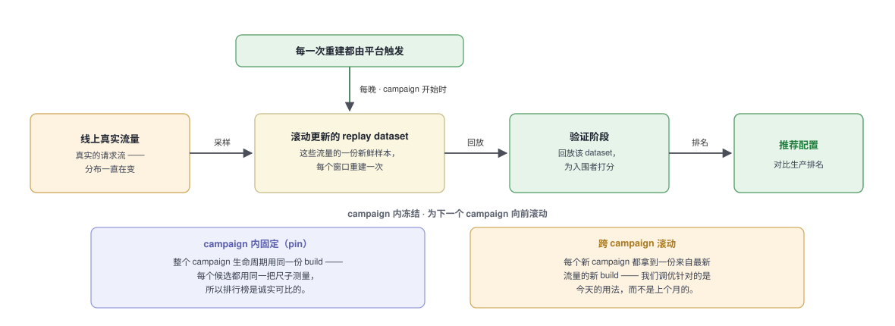
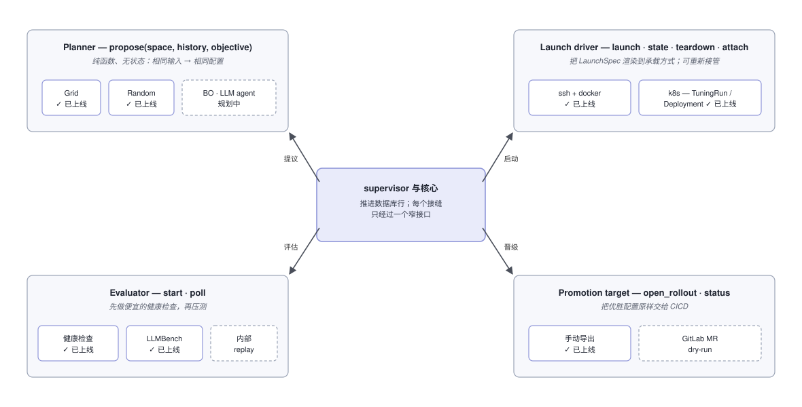

# 架构概览

*面向工程师：这个系统是什么、怎么组织的、以及决定其余一切的少数几个关键选择。
产品向的姊妹文档见 [workflow-overview-zh.md](workflow-overview-zh.md)。*

LLM Autotune 自动为 LLM 推理引擎（sglang、vllm）找到最优部署配置。你给它一个模型、
一个引擎参数的搜索空间和一个目标；它把候选配置部署到 GPU 上、逐一压测，并报告哪些
配置打败了你线上正在跑的配置。它替代了手工循环——手动部署、压测、把数字粘到文档、
重复。

工作在**夜间窗口**里进行：机器晚上从生产退役、交给平台调优，早晨之前恢复生产。一次
campaign 通常跨多个夜晚，每晚从持久化的状态继续。

---

## 1. 系统整体形态

**控制栈**（左侧）从最抽象到最贴近硬件分层；**数据平面**（右侧）记录一切并负责测量。

- **控制层** —— 以 campaign 和配置为单位思考。Campaign Manager 管调什么；可替换的
  policy 容器生成候选配置；Orchestrator（supervisor 主控）负责调度、把 run 装箱到 GPU
  上、并推进每个 run。
- **执行层** —— 以机器和容器为单位思考。Resource Manager 管租约、GPU 台账、以及
  （仅裸金属上）baseline 的捕获与恢复；Launch Layer 通过**按机器选择**的 driver 部署
  引擎。
- **硬件层** —— 两种承载方式，每台机器用一种：我们 ssh 进去的裸金属机器，或 GPU
  集群的一片。两者处理方式不同，见 §2。
- **数据平面** —— Experiment Store（Postgres）是整个系统的记忆；Evaluation 探测已
  部署的服务并跑压测；数据集提供 replay 流量；报告渲染晨报。数据平面不直接碰硬件。

---

## 2. 两种承载方式，一套契约

机器声明自己的 `driver`，因此迁移期间机队是混合的。Launch Layer 无论哪种方式都渲染
**同一个 `LaunchSpec`、同一条引擎命令**——只有承载方式不同，各自按自己的规则处理。

关键区别：裸金属机器是**与生产共用的**，所以必须捕获并恢复；k8s 分片是**借用空闲配额**，
所以什么都不用拆、baseline 生命周期是空操作。k8s driver 从不挑节点或设备——它向调度器
要一个 GPU **数量**，并用 `node_selector` 固定落点（模型权重目前是每节点的 hostPath）。
起不来的 pod（挂载错、镜像拉不下来）会**快速暴露真实原因**，而不是干等超时。完整细节见
[deploy/k8s/README.md](../../deploy/k8s/README.md)。

---

## 3. 决定一切的核心思想：状态机，而非任务队列

一个 run 是 **Postgres 里的一行**，不是队列里的任务。单个 **supervisor** 进程在每个
tick 醒来，把每个未终结的 run 推进*一步合法转移*，然后一次性提交。没有分发；每个 tick
都从数据库重新算出下一步该做什么。

为什么用状态机而不是任务队列：

- **崩溃恢复免费。** 启动时 supervisor 会为每个在跑的 run 重建其 spec，并调用
  `driver.attach()` 去*重新找到*已有部署，而不是重启它。一个在压测中途挂掉的 worker
  会重新接管正在跑的模型继续轮询——因为每个外部引用（容器名、endpoint、压测 id）都
  存在行上，而不是内存里。
- **恰好一个写者。** supervisor 持有一个 Postgres advisory lock；第二个 worker 起
  不来。（曾经两个 worker 争抢，互相杀掉了对方的 run。）
- **状态就是一条 `SELECT`，** 不需要去推断队列内部。

一个 tick 的顺序：推进排期 → 推进租约 → 处理停止请求 → 敲定数据集固定（§5）→ 规划 →
推进 baseline 生命周期 → 调度（装箱到 GPU）→ 推进各 run → 执行窗口截止。两个时钟*先*跑，
这样一个 tick 绝不会启动同一个 tick 就要拆掉的 run。

---

## 4. 便宜的检查在前，昂贵的测试在后

候选配置在能拦住它的最便宜的关卡上就被淘汰：

**纸面校验**（零成本——约束、显存放得下）→ **启动 + 健康**（秒级——既要跑起来又要
回答正确）→ **筛选压测**（分钟级——给所有人打分）→ **复核**（可选——重跑前几名以
盖过约 0.25% 的噪声）→ **验证**（可选，约 1 小时——回放真实流量，仅入围者，用它自己
的目标打分）。

这正是让每晚约 15–30 组实验有价值的原因。一个内建的坑：**"跑完"不等于"通过"**——
LLMBench 在模块只是跑完时就报 `done`；结论是单独的，所以评估器会把 `done + 未通过`
映射成一次失败，并点名越过的红线。

---

## 5. 度量的尺子随生产一起滚动

验证阶段回放**真实的生产流量**，而这份流量会漂移——所以 replay dataset 是**滚动**的，从
线上生产重新采样。LLMBench 自己收集的 profile 每 24 小时滚动一次，这对 LLMBench 是对的，
对一个跨多晚的 campaign 却是错的：一次重建落在 campaign 中途，会悄悄把测量工具换掉，而
来自两份 build 的两个分数根本不是一次比较。

所以平台自己掌控这次滚动，而不是被动继承：

- **由我们触发重建，而不是 LLMBench 的时钟。** 一个 profile 被单独设成
  `schedule_interval_hours: 0`，除了我们的 `trigger_build` 调用，没有任何东西会重建它。
  整个耦合就是：我们要一份 build、被告知它的 id，再从每条结果里把这个 id 读回来
  （`replay_prod.dataset_id` / `_sha256`）。我们从不获取或查看数据——id 背后的一切都由
  LLMBench 拥有。
- **跨 campaign 新鲜。** 每个 campaign 在第一次测量时解析出 profile 的当前 build；在
  `rebuild_at_start` 下，它会从最新流量触发一份新的。这正是让调优对得上*当前*用法的原因
  ——优胜是针对模型此刻的用法最优，而不是针对一份陈旧快照。
- **campaign 内冻结。** 一个 campaign 在第一次测量时**固定（pin）**自己的 build
  （`dataset_build_id`）并用满全程。重建是排他写、pin 是共享读，所以一个 campaign 若在
  别人还持有当前 build 时到来，它会 **adopt（沿用）**那份，而不是重建——数据稍旧，但两个
  campaign 变得直接可比，这更值。
- **要得早、用得晚。** pin 在窗口开启时就敲定，而不是等验证要用时：筛选几十个候选要花几
  小时、且完全不碰 dataset，所以一份在夜晚开头就请求的 build，早在第一个回放 run 需要它
  之前就已发布。没有任何东西会阻塞一个 tick——一份在途的 build 只是一个下次再轮询的行 id
  （409 表示已经有人要过了；去轮询*他们的*行，而不是再叠一份 build）。

每条结果都带着它实际跑在哪份 dataset 上，所以一个测在错 build 上的 run 会被标成**不可比**，
而不是被悄悄排进榜里——这是判断两晚的回放数字到底能不能比的唯一办法。

---

## 6. 每个边界都是可替换的接缝

沿这些接缝的模块化是硬性要求：每个接缝都是一个窄接口，背后有可互换的实现，注册在
一个 registry 里，核心永远不知道自己在和哪个实现对话。

- **Policy** —— 外部容器，通过 policy session API 提出配置。（每个 tick
  重建），且目标在到达 policy 之前就*集中*应用，所以任何搜索读到的历史
  完全一致。
- **Launch driver** —— 在一个 `LaunchSpec` 上的 `launch · state · teardown ·
  attach`（见 §2）。
- **Evaluator** —— `start · poll`，拆开是为了让 tick 循环永不阻塞、且返回的引用可
  重新接管。
- **Promotion target** —— `open_rollout · status`，刻意与 driver 契约对称，把优胜
  配置原样交给 CICD。

回报：ssh→k8s 迁移只动了一个接缝；换一个更聪明的搜索完全不用动平台代码——它是一个容器。

---

## 7. 几条承重规则

- **职责分离。** 搜索从不碰机器——它是数据进、配置出。supervisor 是机器和 run 的
  *唯一*写者；这正是单写者锁要保护的东西。
- **派生状态只算一次。** 生命周期判断（这个租约在排空吗？这个 run 还塞得进窗口吗？
  canary 通过了吗？）由 supervisor 和 Resources 页面共用，所以 worker 和 UI 不会打架。
  同样，目标与可行性在结果落库时就算好并存在行上。
- **baseline 互锁。** 实验只在机器处于 `cleared` 时才跑，而清空生产要求*本 campaign
  自己的* canary、在*这台*机器上、**已通过**——绝不销毁没捕获过的东西，绝不把生产还
  没恢复的机器交还回去。
- **结果保持可比。** 配置在一份冻结的流量样本——campaign 固定的那份 dataset build（§5）
  ——上打分，且每晚都重测生产，所以"生产的 1.15 倍"在绝对数字漂移的情况下依然成立。

---

*背景：[design-brainstorm.md](design-brainstorm.md)（原理，英文）、
[tech-stack.md](tech-stack.md)、[deploy/k8s/README.md](../../deploy/k8s/README.md)。*
