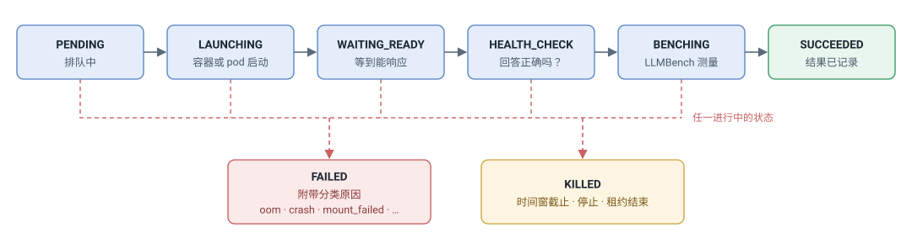
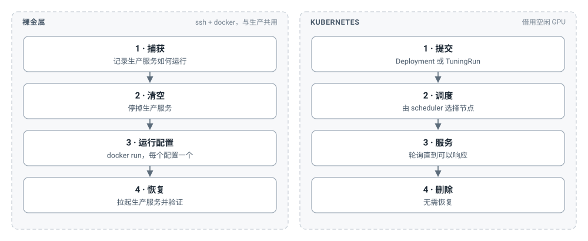
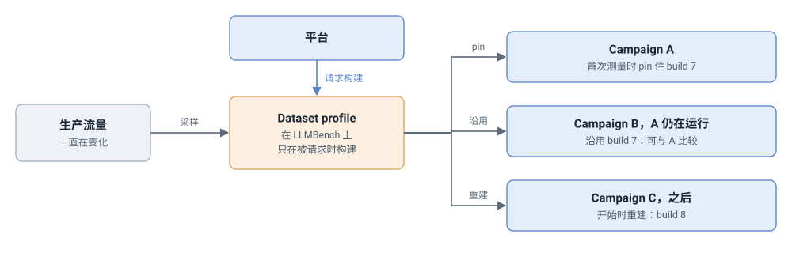
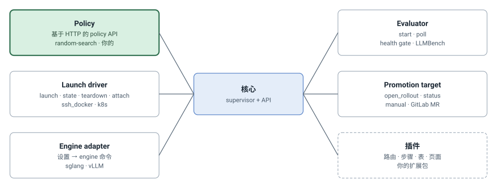

# 架构

面向工程师：平台是怎么搭起来的，以及决定其余一切的几个关键选择。不涉及代码的版本见
[产品视角](workflow.zh.md)。English：[Architecture](architecture.md)

- **API** —— 一个 FastAPI 服务：UI 背后的 REST API、[policy API](api/policy-contract.md)、
  [agent API](api/agent-api.md) 和 [machine lease API](api/machine-lease.md)。
- **Supervisor** —— worker：一个推进所有工作的控制循环。
- **Postgres** —— 全部状态。
- **GPU 机器** —— 通过 ssh 访问，或是 Kubernetes 集群的节点。每台机器自己指定 driver，所以一个机器池里两种可以混用。
- **LLMBench** —— benchmark 平台。supervisor 提交 benchmark，然后轮询结果。

## 状态机，而不是任务队列

一个 run 是 Postgres 里的一行，不是队列里的任务。supervisor 大约每 10 秒醒来一次，把每个未完成的
run 推进一个合法步骤，然后提交一次。每个 tick 都从数据库重新算出该做什么。

- **重启不丢东西。** 每个外部句柄（容器、endpoint、benchmark id）都存在行上，重启后的 worker 会重新接上
  还在跑的工作，而不是重新启动。
- **只有一个写入者。** supervisor 持有一把 Postgres advisory lock，第二个 worker 起不来。
- **失败有分类。** 基础设施类失败（端口、挂载、镜像）会重试；配置本身崩溃或 OOM 不会。

policy 请求的 engine 还会用到一个状态 `serving`：像普通 run 一样启动并做健康检查，然后留给 policy 使用，
而不是直接压测。

一个 tick 的顺序：插件步骤 → campaign 时间窗 → 租约 → 停止请求 → dataset pin → 规划 → baseline 生命周期 →
policy session → 调度 → 推进 run → 执行时间窗截止 → 回收已拆除的容器 → 自动晋级。时钟类步骤先跑，所以一个
tick 不会启动同一个 tick 就要拆掉的 run。

## 两种承载方式，同一个 launch spec

两个 driver 把同一个 `LaunchSpec` 渲染成同一条 engine 命令，区别只在跑在哪里。

裸金属机器和生产共用，所以清空之前先捕获，归还之前先恢复。Kubernetes 上的 run 借用空闲 GPU，所以不需要恢复。
Kubernetes driver 只申请 GPU 数量，由 scheduler 放置 pod（机器可以指定 node selector）；起不来的 pod，
比如模型路径不存在、镜像拉不下来，会很快带着真实原因失败。它渲染一个普通 `Deployment`，或者交给
[operator](../operator/README.md) 的 `TuningRun`。

## 便宜的检查在前

一个配置会停在能拦住它的最便宜的那一关：

- **纸面检查** —— search space 的约束和显存是否够，什么都不用启动。
- **启动 + 健康检查** —— engine 能起来，并且回答正确。
- **Benchmark** —— 每个配置都在 LLMBench 上跑，受 objective 的 redline 约束。
- **复核**（`confirm_top_k`）—— 重复测最好的几个，排除噪声。
- **验证**（`verify_benchmark_slug`）—— 对前 3 名回放真实流量。

LLMBench 在各个模块跑完时就报告 `done`，是否通过是另一回事。平台把"跑完但没通过"当作失败，并写明越过了哪些 redline。

## Dataset：campaign 内冻结，campaign 之间更新

replay benchmark 回放一份生产流量样本，而流量会变化。什么时候重建样本由平台决定，而不是定时器。

- **由平台触发构建。** profile 设置为 `schedule_interval_hours: 0`，所以只有平台会重建它。平台从不读取数据，
  只记录每条结果上报的 build id。
- **一个 campaign 在第一次测量时 pin 一个 build** 并一直用它，所以它的所有候选面对的是同一批请求。
- **如果另一个 campaign 还持有当前 build，新 campaign 会沿用它**，而不是在它下面重建；两者因此可以直接比较。
- **`rebuild_at_start`** 从最新流量重建；`use_current` 直接用当前的 build。

在不同 build 上测得的结果会被标为不可比，而不会进入排名。

## 接缝

每个边界都是一个窄接口，实现注册在 registry 里；核心不知道自己在和哪个实现打交道。

| 接缝 | 接口 | 实现 |
|---|---|---|
| Policy | [policy API](api/policy-contract.md)，基于 HTTP | 任意容器；自带 [random search](https://github.com/modelsphere/llm-autotune-policies/tree/main/random-search) |
| Launch driver | `launch · state · teardown · attach` | `ssh_docker`、`k8s` |
| Engine adapter | 设置 → engine 命令 | `sglang`、`vllm` |
| Evaluator | `start · poll` | health gate、LLMBench |
| Promotion target | `open_rollout · status` | `manual`、`gitlab` |
| 插件 | 路由、tick 步骤、表、页面 | [你的扩展包](plugins.md) |

平台会校验并规范化 policy 提出的每个配置，并自己计算 objective，所以 policy 看到的和排行榜排出的不会不一致。

## 规则

- **职责分离。** policy 从不碰机器。supervisor 是机器和 run 的唯一写入者。
- **共用判断。** 生命周期问题（这个租约在排空吗？这个 run 塞得进时间窗吗？）由 worker 和 UI 共用同一段代码回答，
  所以两边不会不一致。
- **baseline 互锁。** 在共用机器上，只有生产已被捕获并清空后才跑实验；只有生产已恢复并能响应后才归还机器。
- **结果可比。** 一个 campaign 在 pin 住的 dataset 上给每个配置打分，并用同样方式测量生产，所以即使绝对数字漂移，
  "比生产高 12%"依然成立。
