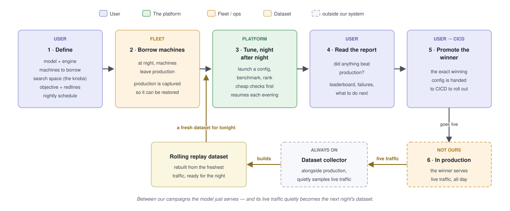
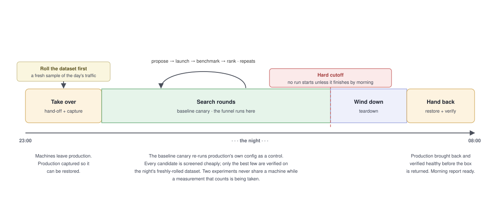
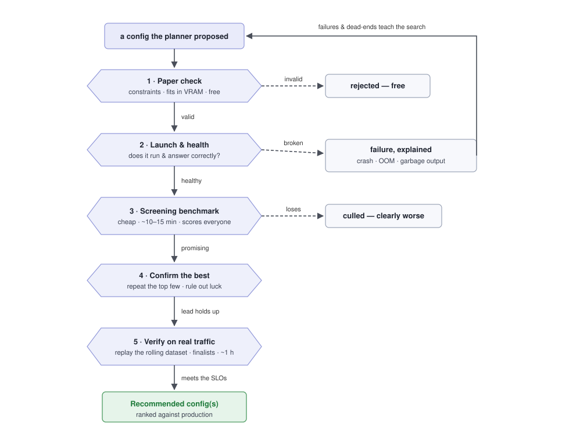
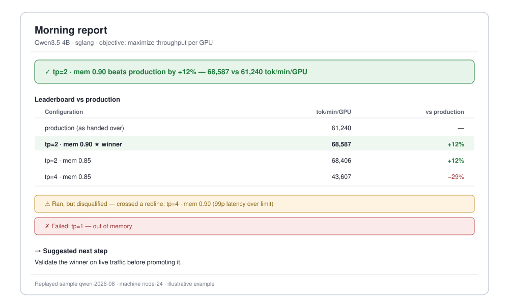

# How LLM Autotune Works — a Product Walkthrough

*For product managers and anyone who wants the what-and-why without the code.
Engineering companion: [architecture-overview.md](architecture-overview.md).*

## The problem it solves

Serving an LLM well depends on getting a pile of deployment parameters right — how
many GPUs a copy of the model spans, how much memory it reserves, which scheduler
and decoding tricks are on. The right settings differ per model and per GPU, they
interact, and the only way to know is to try them. Today an engineer does this by
hand and records results in a shared doc.

LLM Autotune automates that loop. The user declares **what to tune** and **what
"good" means**; the platform tries configurations on real GPUs overnight, measures
each against a real benchmark, and each morning reports which settings beat
production — with the evidence.

## The journey, end to end

A unit of work is a **campaign**: "find the best settings for *this* model on
*these* machines." A user sets it up once; the platform works on it night after night.

**What the user sets up (step 1):** the model & engine · the **search space** (the knobs
and values to try) · the **objective** and its **redlines** (limits a config must
respect — a fast config that breaks one is disqualified, not a winner) · the
machines to borrow · the nightly schedule. Most of these are reusable across
campaigns.

## What happens each night

Machines leave production; the platform captures the production service so it can
be put back exactly, re-runs production's own settings as a **baseline** to beat,
then tries candidates until morning. Two things protect production: a **hard
cutoff** (nothing starts that can't finish, and production is restored and
verified before hand-back), and **clean measurements** (two experiments share a
machine only during quick checks — anything that decides something gets a machine
to itself). A large search simply spans several nights.

## How a config earns its keep

The platform runs only so many experiments a night, so cheap checks eliminate bad
configs first and only survivors reach the costly tests.

Nothing is wasted: a config that fails is **classified and recorded** (crashed,
out of memory, garbage output, missed a redline), and that steers the search away
from similar dead-ends.

## Testing against today's traffic, not last month's

The expensive test replays **real production traffic** — but production traffic
is a moving target. What users ask the model to do this month is not what they
asked last month, and a config tuned against a stale sample wins a race nobody is
running. So the replay dataset is a **rolling** one: a fresh sample of live
production requests, and *the platform triggers its rebuild* rather than waiting
on anyone else's schedule. That is how we keep the test meaningful to the latest
data pattern — every campaign measures against how the model is actually used
**now**. (This is the loop beneath the journey diagram above: after step 5 the
winner serves live in production, a collector samples that live traffic, and the
fresh dataset feeds back in just before step 3.)

Two things have to be true at once, and they pull in opposite directions:

- **Fresh**, so the test reflects current reality — the platform triggers a new
  build from the latest traffic when a campaign needs one.
- **Frozen**, so a campaign's candidates are comparable — ranking configs only
  means something if every one of them faced the *same* requests, so a campaign
  **pins** one build for its whole life and never lets it change underneath a
  measurement.

The resolution is fresh *between* campaigns, frozen *within* one: each campaign
locks onto a single dataset for its own leaderboard, and the next campaign rolls
forward to a newer sample. Every result also records exactly which dataset it was
measured on, so two campaigns are never quietly compared across different traffic.

## What comes back — the morning report

Plain text that pastes straight into chat or a ticket. It leads with a **verdict**, ranks
the configs **against production**, lists what was **disqualified** or **failed**
and why, and suggests a **next step**:

Two honest non-answers it gives instead of a false win: *"no meaningful
difference"* (the lead is inside the measurement-noise band) and *"unstable"* (the
repeated measurements disagree by more than the lead itself).

## Promoting a winner

A campaign's winner is a single, **exact, reproducible** configuration that can be
handed to the deployment pipeline. Today that's a config applied by hand; the platform
is built to plug into the team's CICD (a GitLab merge request, and eventually an
automated A/B test that graduates the winner) without changing anything upstream.

## The guarantees that matter

- **Production is protected** — captured before it's touched, restored and
  verified before hand-back; nothing destroyed that can't be put back.
- **Results are comparable across nights** — a campaign scores every config on
  one frozen sample of real production traffic, with production re-measured each
  night as the reference point; fresh campaigns roll that sample forward, and
  each result records which sample it used so cross-campaign comparisons stay honest.
- **Honest about noise** — it won't call a sub-noise difference a win, and repeats
  measurements before crowning anything.
- **Everything is recorded** — settings, versions, exact command, results, failure
  cause — enough to reproduce any run and audit every decision.
- **One clear authority** — the part that picks what to try never touches
  machines; a single component may start, stop, or occupy anything.

## A few terms

- **Campaign** — one tuning job: a model, a search space, an objective, a schedule.
- **Config** — one specific set of engine settings being tested.
- **Baseline / canary** — production's current settings, re-measured as the thing
  to beat and as a health check on the machine.
- **Redline** — a hard limit (latency, correctness) a config must respect to count.
- **Screening vs. verification** — the cheap benchmark everyone runs vs. the
  expensive real-traffic replay reserved for finalists.
- **Rolling dataset** — the real-traffic sample the verification replays;
  refreshed from live production so tests track current usage, frozen within a
  campaign so that campaign's configs stay comparable.
- **Promotion** — handing a winning config to the pipeline that deploys it.
