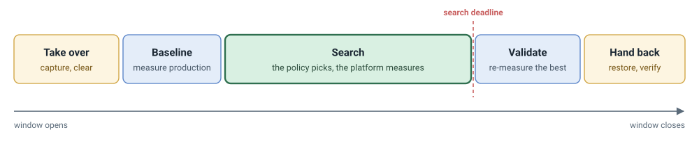
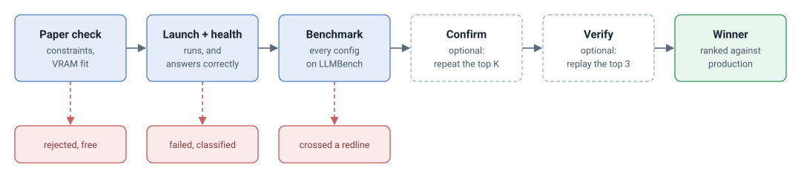

# How it works

For anyone deciding whether LLM AutoTune solves their problem; no code. The
engineering view: [Architecture](architecture.md). 中文：[产品视角](workflow.zh.md)

## The problem

How well an LLM serves depends on a pile of engine settings: how many GPUs one
copy spans, how much memory it reserves, which scheduler and decoding options
are on. The right values differ per model and per GPU, they interact, and the
only way to know is to try them. LLM AutoTune does the trying: on real GPUs,
measured the same way every time, ranked against what production runs today.

## A campaign, end to end


1. **Define** the model and engine, the **search space** (the settings and
   values to try), the **objective** (one metric to improve, plus **redlines**
   such as a latency limit that a config must hold), and a schedule.
2. **Lend machines.** Production machines join for a nightly window, or a
   Kubernetes cluster lends idle GPUs.
3. **Tune.** A **policy**, the search algorithm, picks configs; the platform
   runs and measures them. A large search spans several nights and resumes
   where it stopped.
4. **Read the report** each morning.
5. **Promote** the winner as a merge request against your deploy repo.

## One night



The platform captures the production service so it can be put back exactly,
then measures production's own config as the **baseline** to beat. The policy
searches until the deadline; the platform then re-measures the policy's best
configs itself, restores production, checks it answers, and hands the machine
back. Nothing starts that cannot finish inside the window, and a measurement
that decides anything gets its machine to itself.

## How a config earns its place



Cheap checks run first, so the expensive ones are spent on configs that might
win. A config that fails is recorded with why (crashed, out of memory, wrong
answers, crossed a redline), and the policy sees that too.

## Testing against today's traffic

The most telling benchmark replays real production traffic, and that traffic
changes month to month. So the replay dataset is **fresh across campaigns**
(a new campaign can rebuild it from the latest traffic) and **frozen within
one** (every config in a campaign faces the same requests). Each result records
the dataset it ran on, so numbers from different datasets are never compared.

## The report

Markdown that pastes into chat or a ticket:

```markdown
# qwen3-8b-tp-sweep

- **Objective**: maximize `output_tps`
- **Model**: `/models/Qwen3-8B` on `sglang` (`lmsysorg/sglang:v0.5.4`)
- **Runs**: 14 succeeded, 2 failed, 1 baseline

## Verdict

**mem_fraction_static=0.9, tp=2** beats production by **+12.0%** (6,858.7 vs 6,124.0), on a single measurement

## Results

| Config | output_tps | vs production | Runs |
|---|---|---|---|
| production (as handed over) | 6,124.0 | — | 41 |
| mem_fraction_static=0.9, tp=2 | 6,858.7 | +12.0% | 47 |
| mem_fraction_static=0.85, tp=2 | 6,840.6 | +11.7% | 45 |

## Ran, but crossed one of the objective's redlines
## Failures
## Suggested next steps
```

It will not call a win it cannot back: a lead inside the noise band is
reported as **no meaningful difference**, and repeats that disagree by more
than the lead as **unstable**.

## What you can rely on

- **Production is protected.** Captured before it is touched, restored and
  checked before the machine goes back.
- **The platform measures.** Every config is benchmarked the same way, and a
  policy's own numbers never decide the result.
- **Results are comparable.** One frozen dataset per campaign, production
  measured the same way, and the dataset recorded on every result.
- **Everything is recorded.** Settings, versions, the exact launch command,
  results and failure causes: enough to reproduce any run.
