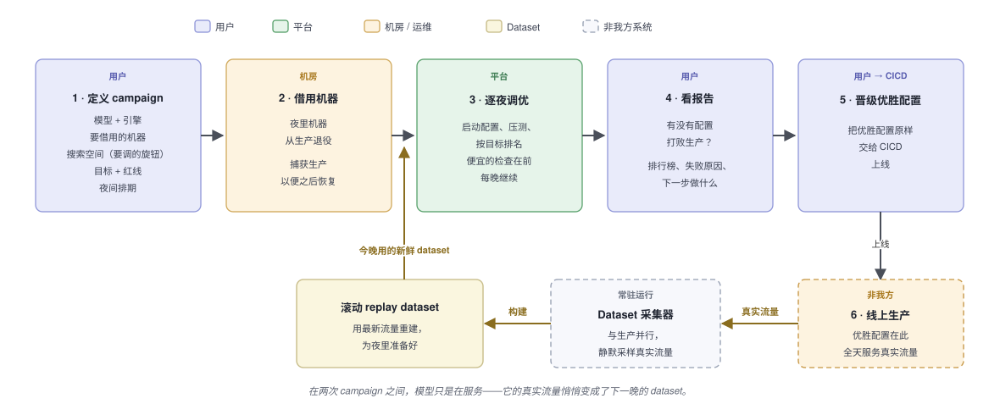
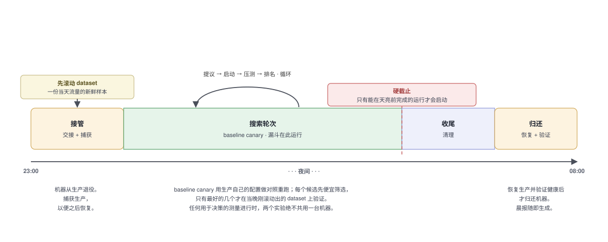
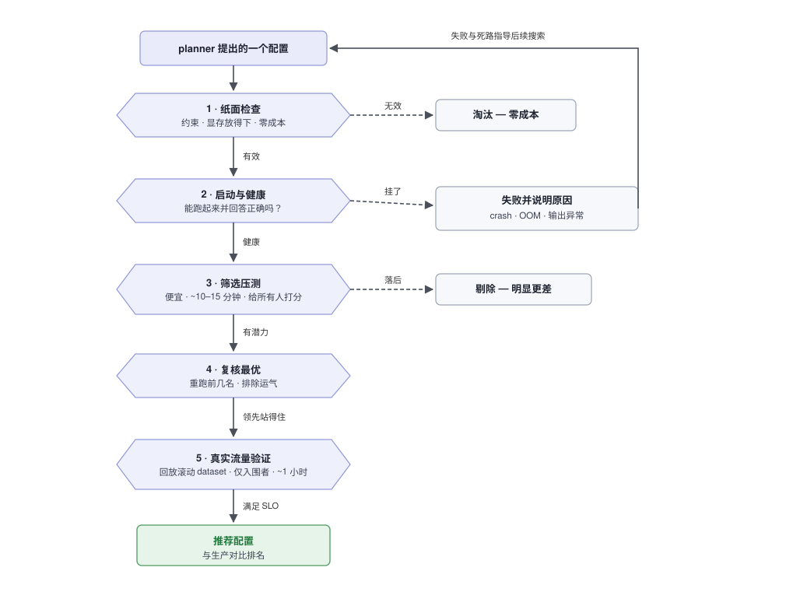
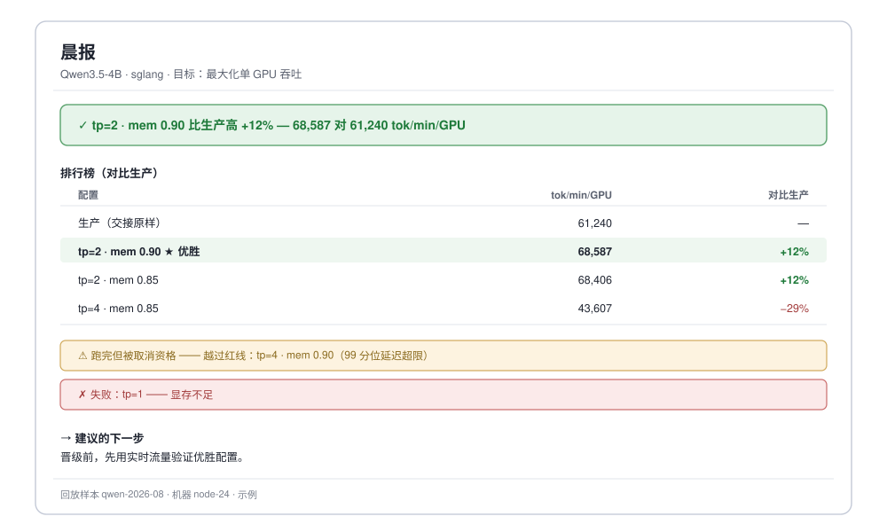

# LLM Autotune 是怎么工作的 —— 产品视角

*面向产品经理，以及想不看代码就理解"做什么、为什么"的人。工程向的姊妹文档见
[architecture-overview-zh.md](architecture-overview-zh.md)。*

## 它解决的问题

把一个 LLM 服务好，取决于一堆部署参数是否调对——一份模型副本跨几张 GPU、预留多少
显存、开哪些调度器和解码技巧。最优设置因模型、因 GPU 而异，彼此还会相互影响，唯一
知道答案的办法就是逐个试。今天工程师靠手工做这件事，并把结果记在一个共享文档里。

LLM Autotune 把这个循环自动化。用户明确**要调什么**、以及**"好"是什么意思**；平台连夜
在真实 GPU 上试各种配置、用真实压测测量每一个，第二天早上报告哪些设置打败了生产
——还带着证据。

## 端到端的流程

一个工作单元叫 **campaign**：为*这个*模型、在*这些*机器上找到最优设置。用户只需设置
一次，平台就会一晚接一晚地推进它。

**用户要设置的（第 1 步）：** 模型与引擎 · **搜索空间**（要试的旋钮和取值）· **目标**
及其**红线**（配置必须守住的上限——一个跑得快但越线的配置是被取消资格，而不是优胜）·
要借用的机器 · 夜间排期。这些大多可以在多个 campaign 之间复用。

## 每个夜晚发生什么

机器从生产退役；平台先捕获生产服务以便原样放回，把生产自己的设置作为要打败的
**baseline** 重跑一遍，然后一直试候选，直到天亮。两件事保护生产：**硬截止**（不会启动
赶不完的运行，且归还前会恢复并验证生产），以及**干净的测量**（只有快速检查阶段才允许
两个实验共用一台机器——任何用于决策的测量都独占整机）。搜索规模大时，就自然跨多个
夜晚。

## 一个配置如何证明自己

平台每晚能跑的实验有限，所以便宜的检查先淘汰坏配置，只有幸存者才进入昂贵的测试。

没有浪费：失败的配置会被**分类并记录**（崩溃、显存不足、输出异常、越过红线），这些
反馈会引导搜索避开类似的死路。

## 针对今天的流量测试，而不是上个月的

昂贵的那一档测试回放**真实的生产流量**——但生产流量是个移动的靶子。用户这个月让模型
做的事，和上个月不一样；一个针对陈旧样本调好的 config，赢的是一场没人在跑的比赛。所以
replay dataset 是**滚动更新**的：一份来自线上生产请求的新鲜样本，而且**由平台来触发它的
重建**，而不是等别人的排期。这正是我们让测试对得上最新数据模式的方式——每个 campaign
测的都是模型**当下**真实的用法。（这就是上面 campaign 流程图下方的那条回路：第 5 步
优胜上线后，采集器从线上真实流量采样，新鲜的 dataset 在第 3 步之前喂回来。）

有两件事必须同时成立，而它们方向相反：

- **新鲜**，让测试反映当下的现实——当一个 campaign 需要时，平台就从最新流量触发一次新
  的 build。
- **冻结**，让一个 campaign 内的候选彼此可比——给 config 排名，只有在每个候选都面对*同
  一批*请求时才有意义，所以一个 campaign 会**固定（pin）**一份 build 用满全程，绝不在
  测量进行中让它变。

答案是：**跨** campaign 新鲜、在 campaign **内**冻结。每个 campaign 锁定一份 dataset 做
自己的排行榜，下一个 campaign 再向前滚动到更新的样本。每条结果也都记录了它究竟是在哪份
dataset 上测的，所以两个 campaign 绝不会在不知情的情况下、跨着不同的流量被拿来比较。

## 产出 —— 晨报

一段可以直接粘进聊天或工单的纯文本。它以**结论**开头，把各配置**对比生产**排名，列出
被**取消资格**或**失败**的以及原因，并给出**下一步建议**：

它会给出两种诚实的"非答案"，而不是假装赢了：*"没有显著差异"*（领先落在测量噪声带
以内）和*"不稳定"*（多次重测之间的差异比领先本身还大）。

## 晋级优胜配置

一个 campaign 的优胜，是一份唯一、**可精确复现**的配置，可以交给部署流水线。今天这
是一份需人工应用的配置；平台的设计让它能接入团队的 CICD（一个 GitLab merge request，
以后是一个自动 A/B 测试来让优胜逐步放量），而不需要改动上游任何东西。

## 真正重要的保证

- **生产受保护** —— 动手之前先捕获，归还之前先恢复并验证；绝不销毁放不回去的东西。
- **结果跨夜可比** —— 一个 campaign 把每个 config 都放在同一份冻结的真实流量样本上打分，
  且每晚把生产作为参考点重测；新的 campaign 会把这份样本向前滚动，每条结果都记录它用的
  是哪份样本，让跨 campaign 的比较保持诚实。
- **对噪声诚实** —— 不会把低于噪声的差异叫成胜利，crown 之前先重测。
- **一切都留档** —— 设置、版本、精确命令、结果、失败原因——足够复现任何一次运行、
  审计每一个决策。
- **单一权威** —— 挑配置的那部分从不碰机器；只有一个组件有权启动、停止或占用资源。

## 几个术语

- **campaign** —— 一次调优任务：一个模型、一个搜索空间、一个目标、一份排期。
- **配置（config）** —— 正在被测试的一组具体引擎设置。
- **baseline / canary** —— 生产当前的设置，被重测作为"要打败的对象"，也顺带检查机器
  是否健康。
- **红线（redline）** —— 一个配置必须守住才算数的硬上限（延迟、正确性）。
- **筛选 vs 验证** —— 所有人都跑的便宜压测，对比只留给入围者的、昂贵的真实流量回放。
- **滚动 dataset（rolling dataset）** —— 验证阶段回放的那份真实流量样本；从线上生产刷新
  以跟上当前用法，在一个 campaign 内冻结以让该 campaign 的 config 保持可比。
- **晋级（promotion）** —— 把优胜配置交给部署它的流水线。
