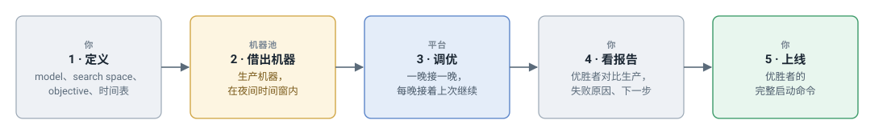
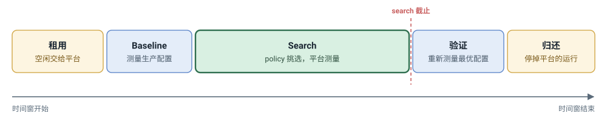
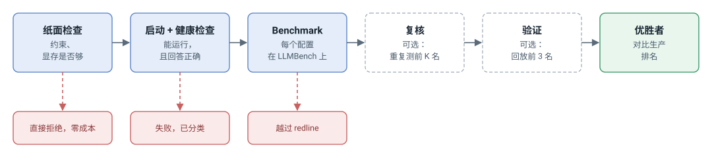

# 产品视角

给正在判断 LLM AutoTune 能不能解决自己问题的人看，不涉及代码。工程视角见 [架构](architecture.zh.md)。
English：[How it works](workflow.md)

## 要解决的问题

一个 LLM 服务得好不好，取决于一堆 engine 设置：一份模型跨几张 GPU、预留多少显存、用哪种 scheduler 和解码选项。
合适的值随模型和 GPU 而变，彼此还会相互影响，唯一的办法是去试。LLM AutoTune 负责去试：在真实 GPU 上，
每次用同样的方式测量，并和生产当前的配置比较排名。

## 一个 campaign 的全过程



1. **定义** model 和 engine、**search space**（要试的设置和取值）、**objective**（要提升的一个指标，加上
   配置必须守住的 **redline**，比如延迟上限）以及时间表。
2. **借出机器。** 生产机器在夜间时间窗内加入，或者由 Kubernetes 集群借出空闲 GPU。
3. **调优。** **policy**（search 算法）挑选配置，平台运行并测量。大的 search 会跨多个夜晚，每次从上次停下的地方继续。
4. **每天早上看报告。**
5. **晋级**：把优胜者作为 merge request 提交到你的部署仓库。

## 一个夜晚



机器空闲地租给平台。平台先测量生产自己的配置作为要超过的 **baseline**。policy 一直 search
到截止时间；然后平台亲自重新测量 policy 的最优配置，停掉自己的运行，再归还机器。不会启动在时间窗内
跑不完的东西；任何用来做决定的测量都独占机器。

## 一个配置怎样胜出



便宜的检查先跑，昂贵的测试只留给有希望胜出的配置。失败的配置会记录原因（崩溃、OOM、回答错误、越过 redline），
policy 也能看到这些信息。

## 用今天的流量测试

最能说明问题的 benchmark 会回放真实的生产流量，而流量每个月都在变。所以 replay dataset 在 **campaign 之间是新的**
（新 campaign 可以用最新流量重建），在 **campaign 内是冻结的**（同一个 campaign 里每个配置面对同一批请求）。
每条结果都记录它用的 dataset，所以来自不同 dataset 的数字不会被拿来比较。

## 报告

Markdown 格式，可以直接贴到聊天或工单里：

```markdown
# qwen3-8b-tp-sweep

- **Objective**: maximize `output_tps`
- **Model**: `/models/Qwen3-8B` on `sglang` (`lmsysorg/sglang:v0.5.4`)
- **Runs**: 14 succeeded, 2 failed, 1 baseline

## Verdict

**mem_fraction_static=0.9, tp=2** beats production by **+12.0%** (6,858.7 vs 6,124.0), on a single measurement

## Results

| Config | output_tps | vs production | Runs |
|---|---|---|---|
| production (as handed over) | 6,124.0 | — | 41 |
| mem_fraction_static=0.9, tp=2 | 6,858.7 | +12.0% | 47 |
| mem_fraction_static=0.85, tp=2 | 6,840.6 | +11.7% | 45 |

## Ran, but crossed one of the objective's redlines
## Failures
## Suggested next steps
```

它不会宣布站不住的胜利：领先幅度在噪声范围内时报告 **no meaningful difference**；重复测量之间的差异大于领先幅度时报告 **unstable**。

## 可以依赖的保证

- **生产不会被动到。** 平台只在租给它的机器上运行，也只停掉它自己启动的东西。
- **测量由平台做。** 每个配置都用同样的方式 benchmark，policy 自己的数字从不决定结果。
- **结果可比。** 每个 campaign 一份冻结的 dataset，生产用同样方式测量，每条结果都记录 dataset。
- **一切都有记录。** 设置、版本、完整的启动命令、结果和失败原因：足以复现任何一次 run。
